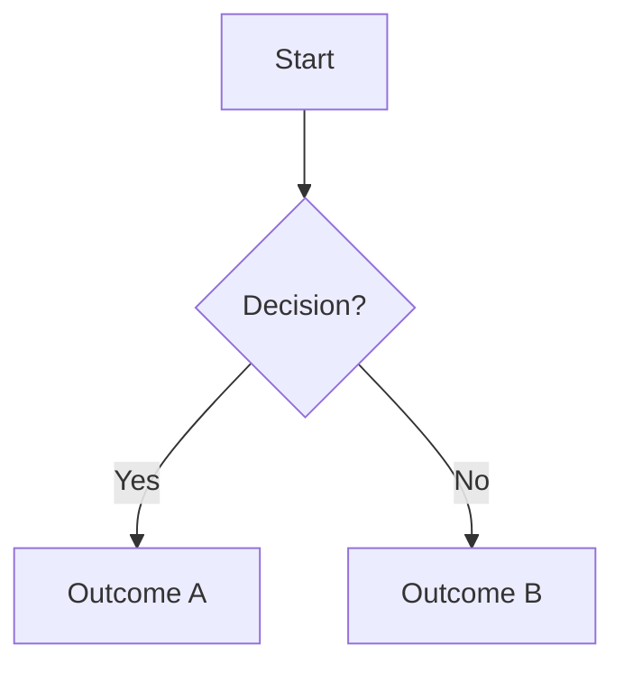
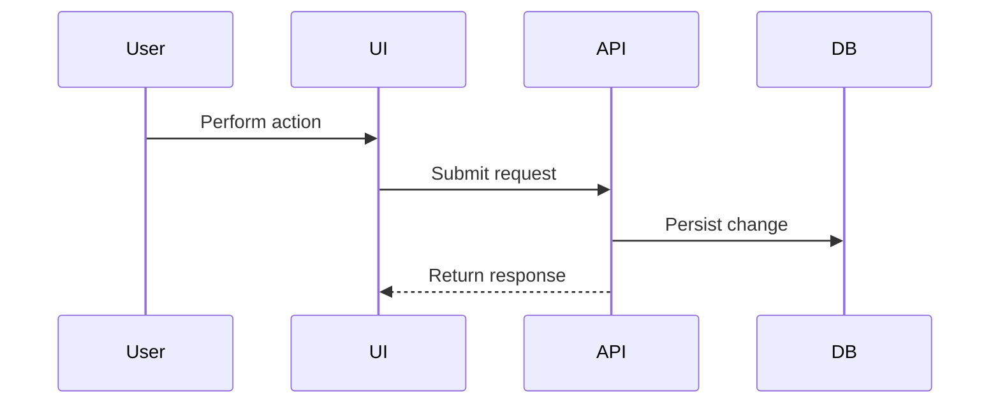
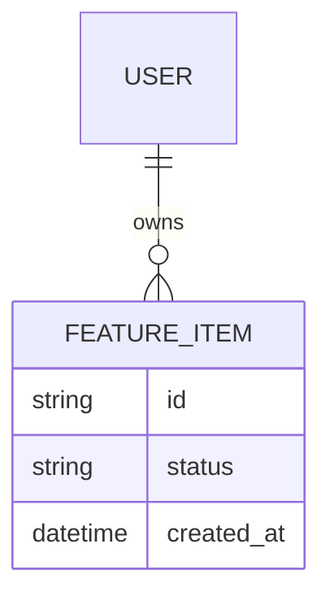

# WBS Linear Issue Template

## Parent Feature Issue

Use this structure for the parent issue description:

```markdown
## Goal
<One or two sentences describing the user/business outcome.>

## WBS Index
1. Scope
2. User stories
3. Acceptance criteria
4. Flowchart for decision-heavy flows
5. Sequence diagram for cross-component flows
6. API contract
7. ERD changes
8. State changes
9. Test cases

## Assumptions
- <Assumption or "None yet.">

## Open Questions
- <Question or "None yet.">
```

Recommended labels: `feature`, `wbs`, plus product/component labels that already exist in Linear.

## Section Issue Shape

Use this structure for each child issue:

```markdown
## Purpose
<Why this WBS section exists for the feature.>

## Inputs
- <Known source requirement, artifact, issue, or assumption.>

## Deliverables
- <Concrete artifact or implementation output.>

## Acceptance / Done
- <Checkable completion condition.>

## Dependencies
- <Related WBS section, component, or issue key.>

## Open Questions
- <Question or "None.">
```

## Required WBS Sections

### 1. Scope

Define in-scope and out-of-scope behavior, affected users, affected surfaces, constraints, rollout boundaries, and non-goals.

Done checks:
- Scope names included surfaces/components.
- Non-goals are explicit.
- Assumptions and unresolved decisions are separated.

### 2. User Stories

Write user stories in the form "As a <user>, I want <capability>, so that <outcome>." Add priority and notes for edge cases when useful.

Done checks:
- Primary and secondary user roles are covered.
- Stories map to acceptance criteria.
- Important edge cases are captured.

### 3. Acceptance Criteria

Use clear Given/When/Then or checklist criteria. Cover success, validation failure, permissions, empty states, error states, and observability/admin expectations where applicable.

Done checks:
- Criteria are testable.
- Each critical user story has criteria.
- Negative and boundary cases are included.

### 4. Flowchart For Decision-Heavy Flows

Use Mermaid for branching product or system decisions:



Done checks:
- Every major decision has named outcomes.
- Error/exception branches are represented.
- The flow references the related user story or acceptance criterion.

### 5. Sequence Diagram For Cross-Component Flows

Use Mermaid for interactions among UI, services, jobs, APIs, queues, databases, or third-party systems:



Done checks:
- Components and ownership boundaries are clear.
- Sync/async behavior is called out.
- Failure, retry, and authorization points are noted when relevant.

### 6. API Contract

Specify endpoints, methods, request/response schemas, auth/permission requirements, validation rules, idempotency, errors, pagination/filtering, versioning, and backward compatibility.

Done checks:
- Request and response examples are included when useful.
- Error codes/messages are actionable.
- Consumers and producers are named.

### 7. ERD Changes

Describe new/changed entities, fields, relationships, indexes, constraints, migrations, backfills, and data retention/privacy implications. Include Mermaid ERD when helpful:



Done checks:
- Migration/backfill path is identified.
- Index and constraint needs are considered.
- Existing data compatibility is covered.

### 8. State Changes

Define state machine changes for UI, domain objects, jobs, integrations, or workflows. Include state names, transitions, guards, side effects, and invalid transitions.

Done checks:
- Initial, terminal, and error states are explicit.
- Transition triggers and permissions are named.
- State persistence and recovery behavior are covered.

### 9. Test Cases

Group by unit, integration, contract, end-to-end, migration, permission/security, accessibility, performance, and regression tests as relevant.

Done checks:
- Tests map back to acceptance criteria.
- Critical paths and failure paths are covered.
- Required fixtures, mocks, and data setup are identified.
