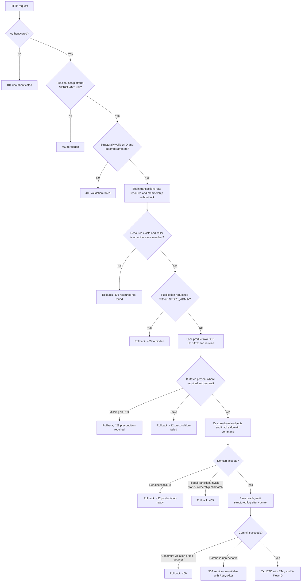
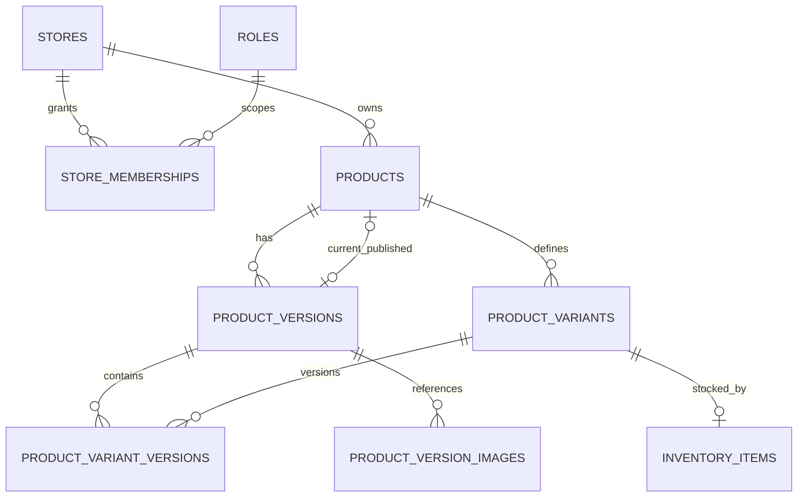

# Feature Specification: Product Lifecycle Application Integration

## Document Control

- **Status:** Draft
- **Feature slug:** `product-publication-lifecycle`
- **Phase:** `application-integration` (Phase 2)
- **Branch:** `feature/product_lifecycle`
- **Intake:** [intake.md](./intake.md)
- **Phase 1 domain slice:** [core-domain/specification.md](../core-domain/specification.md), referenced as `P1-AC-xx` and `P1-UT-xx`
- **Relevant source docs:** [API conventions](../../../contracts/convention/api-conventions.md), [API endpoint delivery process](../../../docs/md/09_api_endpoint_delivery_process.md), [transactions and state](../../../docs/md/05_transactions_and_state.md), [system architecture](../../../docs/md/02_system_architecture.md), [testing plan](../../../docs/md/07_testing_plan.md), [implementation roadmap](../../../docs/md/06_implementation_roadmap.md)
- **Owners:** User - product decisions, domain changes, Flyway migrations, repository adapter, use-case service bodies, CI and infrastructure; Agent - specification, contract draft, conventions amendment, JPA entities and mappers, security wiring, web layer, logging configuration, tests including the container harness

## 1. Goal and Scope

### Goal

Expose the Phase 1 product lifecycle through a contract-first, versioned REST API backed by Oracle, so that a store member can create, list, edit, and submit a product version and a store admin can publish it, with every command atomic, authorized, logged, and verified end to end.
The API and the database are adapters around the use cases; business rules stay in the domain.

### In Scope

- OpenAPI 3.1 contract for eleven operations under `/api/v1` (section 6), `info.version` 0.0.1 to 0.1.0.
- Two cursor-paginated collection endpoints: variants of a product and versions of a product.
- Request/response DTOs with structural validation only.
- Controllers, `X-Flow-ID` correlation, `ETag` with `If-Match` required on draft replacement, RFC 9457 problem mapping.
- `ProductLifecycleService` use cases with one transaction per command, authorization before locking, and a pessimistic lock on the product row.
- Separate JPA entities, Spring Data repositories, entity mappers, and a concrete `ProductLifecycleRepository` adapter.
- Flyway `V3__product_lifecycle_integration.sql` and `V4__event_publication.sql`.
- Stubbed authentication behind a `CurrentActorResolver` interface, with real platform-role, store-membership, and store-role authorization.
- Structured logging configured through Spring Boot.
- Domain changes limited to rehydration and defects found while mapping (section 8, "Required domain changes").
- Amendment of `contracts/convention/api-conventions.md` and alignment of `docs/md/07_testing_plan.md` and `contracts/convention/api_profile_example.md` (delivered with this specification).
- Unit, migration, repository, service, web/contract, E2E API, and packaged-image container tests on Oracle Testcontainers.

### Out of Scope

- Real identity provider (Cognito, JWT resource server) and the platform `ADMIN` role.
- Store, tenant, user, membership, role, and category APIs.
- Listing products of a store.
- Publishing or consuming application events; Redis cache; RabbitMQ.
- Version withdrawal, rejection, revision, superseding, archival, and second-version publication.
- Variant status transitions over HTTP.
- Product slug and its per-tenant uniqueness (deferred, recorded deviation from `AGENTS.md` Database Rules).
- `product_version_prices` usage or price history.
- Storefront reads, uploads, search, frontend, Playwright.
- Changes to `.github/workflows/services.yml` and `compose.yaml` (reported only).

### Assumptions

- Stores, tenants, users, roles, store memberships, and categories exist as rows in the V1 tables; tests and local dev seed them directly.
- A caller is an active member of a store when `store_memberships` has a row for `(store_id, user_id)` with `status = 'ACTIVE'`.
- Store-scoped roles use codes distinct from platform role codes because `roles.code` is globally unique; `STORE_ADMIN` grants publication, and any other active store-scoped membership (seeded as `STORE_MEMBER`) grants member access (assumption for the plain member code).
- `products.tenant_id` is copied from `stores.tenant_id` at creation.
- Existing development data satisfies the new CHECK constraints in V3.
- Spring Modulith treats each top-level package as a module, so all lifecycle adapters live under the `product` module and use other modules only through their base-package domain types.

### Open Questions

No decision is open.
Two items must be verified during implementation:

- **V-01:** `spring-modulith-starter-jpa` registers the JPA event publication entity, so `ddl-auto=validate` fails without the `event_publication` table; V4 exists for this reason. IT-01 confirms the claim; if it is false, V4 can be dropped in a later cleanup.
- **V-02:** `swagger-request-validator` supports OpenAPI 3.1 documents; if not, contract validation falls back to `networknt json-schema-validator` against component schemas.

## 2. User Stories

| ID | Priority | Story |
|---|---|---|
| US-01 | Must | As a store member, I want to create a product for my store through the API, so that the lifecycle has a persisted root. |
| US-02 | Must | As a store member, I want to create variants and initialize their inventory through the API, so that offers can reference stable, stocked variants. |
| US-03 | Must | As a store member, I want to create a draft version and replace its content and offers while it is a draft, so that I can prepare a publishable version safely. |
| US-04 | Must | As a store member, I want to submit a draft version for review and receive a stable reason when it is not ready, so that I can fix it. |
| US-05 | Must | As a store admin, I want to publish a version under review atomically, so that the product always points to a coherent published version. |
| US-06 | Must | As a store member, I want to discontinue, resume, or archive my product, so that paused or retired products cannot gain new reviewed or published content. |
| US-07 | Must | As the platform, I want unauthenticated, wrong-role, and cross-store requests rejected without revealing other stores' data, so that tenant isolation holds. |
| US-08 | Must | As a store member, I want to list a product's variants and versions page by page, so that I can build offers and follow version status without remembering ids. |
| US-09 | Must | As an API consumer, I want every response and error to match the published contract, so that I can integrate without reading server code. |
| US-10 | Must | As an operator, I want migrations to apply cleanly on new and existing databases and the packaged service to start and serve the main flow, so that deployment is safe. |
| US-11 | Must | As an operator, I want structured, correlated logs for every committed lifecycle change, so that I can trace a request without reading request bodies. |

## 3. Acceptance Criteria

All paths below are relative to the base path `/api/v1`.

| ID | Story | Criterion |
|---|---|---|
| AC-01 | US-01 | Given M1 is an active member of store S1, when M1 sends `POST /stores/S1/products` with a valid `product_code`, then the response is 201 with `Location`, the product is `ACTIVE` with null `current_published_version_id`, and the row stores S1's `tenant_id` and M1 as creator. Traces P1-AC-01. |
| AC-02 | US-01 | Given S1 already has a product with code X, when a product with code X is created in S1, then the response is 409 `duplicate-resource` and no row is added; creating code X in another store succeeds. |
| AC-03 | US-02 | Given product P1 of S1, when M1 sends `POST /products/P1/variants` with a new `variant_code`, then the response is 201 with an `ACTIVE` variant; a duplicate `variant_code` within P1 returns 409 `duplicate-resource`. |
| AC-04 | US-02 | Given variant A without inventory, when M1 sends `PUT /product-variants/A/inventory`, then the response is 201 with `quantity_on_hand` as sent and `quantity_reserved` 0; an identical repeat returns 200 unchanged; a differing body returns 409 `inventory-already-initialized` and the stored inventory is unchanged. Traces P1-AC-05, P1-AC-06. |
| AC-05 | US-03 | Given P1 without versions, when M1 sends `POST /products/P1/versions`, then the response is 201 with a `DRAFT` version numbered 1 and an `ETag`; a second creation returns 409 `invalid-status-operation` and no row is added. Traces P1-AC-02. |
| AC-06 | US-03 | Given draft V1 with current `ETag` E, when M1 sends `PUT /product-versions/V1` with `If-Match: E`, content, media references (each with an explicit `is_primary`), and offers, then content, media references, and offers are fully replaced, offer ids stay stable per `product_variant_id`, the `ETag` changes, and P1 is unchanged. Traces P1-AC-03, P1-AC-04. |
| AC-07 | US-03 | Given V1 is not `DRAFT`, when M1 sends a valid `PUT /product-versions/V1`, then the response is 409 `invalid-status-operation` and nothing changes. |
| AC-08 | US-03 | Given V1 was modified after the client read it, when the client sends `PUT` or `PATCH` with the old `If-Match`, then the response is 412 `precondition-failed`; when the client sends `PUT` without `If-Match`, then the response is 428 `precondition-required`; in both cases nothing changes. |
| AC-09 | US-09 | Given any operation, when the request is malformed JSON, has an unknown property, misses a required field, has a wrong type or UUID format, exceeds a length or list cap, marks more than one media reference as primary, has a non-ISO currency, an amount beyond precision 19 scale 4, or a negative quantity, then the response is 400 `validation-failed` with one `errors` entry per violation and nothing changes. |
| AC-10 | US-04 | Given complete draft V1 of `ACTIVE` P1 with active variants, when M1 sends `PATCH /product-versions/V1` with `publication_status: IN_REVIEW`, then the response is 200 and V1 and all its offers are persisted as `IN_REVIEW`. Traces P1-AC-07. |
| AC-11 | US-04, US-05 | Given V1 fails readiness at submission (missing name, description, or category, no active variant, blank or duplicate SKU, non-positive or missing price) or has no offers at publication, when the transition is requested, then the response is 422 `product-not-ready` with `reason` equal to the `ProductReadinessFailure` code (`NO_ACTIVE_VARIANT` for missing offers) and no row changes. Traces P1-AC-08. |
| AC-12 | US-04, US-05 | Given a version outside the required source state (repeat submit, publish from `DRAFT`, repeat publish), when the transition is requested, then the response is 409 `illegal-lifecycle-transition` and no row changes. Traces P1-AC-10. |
| AC-13 | US-04 | Given an offer references a variant of another product, when submission is requested, then the response is 409 `ownership-mismatch` and no row changes. Traces P1-AC-11. |
| AC-14 | US-05 | Given V1 and its offers are `IN_REVIEW`, when A2, a `STORE_ADMIN` member of S1, sends `PATCH /product-versions/V1` with `publication_status: PUBLISHED`, then the response is 200, V1 and all offers are `PUBLISHED`, `published_at` and `published_by_user_id` are set, and P1 `current_published_version_id` is V1, committed together. Traces P1-AC-09. |
| AC-15 | US-05 | Given publication fails for any reason (domain rejection, constraint violation, lock failure), when the transaction ends, then no product, version, or offer row changes. Traces P1-AC-12. |
| AC-16 | US-06 | Given P1, when M1 sends `PATCH /products/P1` with `status` `DISCONTINUED`, `ACTIVE`, or `ARCHIVED`, then allowed transitions return 200 and persist, and disallowed ones return 409 `illegal-lifecycle-transition` with no change. |
| AC-17 | US-06 | Given P1 is `DISCONTINUED` or `ARCHIVED`, when submission or publication of its version is requested, then the response is 409 `invalid-status-operation` and no row changes. Traces P1-AC-13. |
| AC-18 | US-07 | Given no or invalid credentials, when any product endpoint is called, then the response is 401 `unauthenticated` as `application/problem+json`. |
| AC-19 | US-07 | Given a principal without the platform `MERCHANT` role calls any product endpoint, or an active member of S1 without `STORE_ADMIN` requests `publication_status: PUBLISHED` on a version of S1, then the response is 403 `forbidden` and nothing changes. |
| AC-20 | US-07, US-08 | Given U2 (any store role, including `STORE_ADMIN` of another store) is not an active member of S1, when U2 addresses S1 or any product, variant, or version of S1, including list endpoints and publication, then the response is 404 `resource-not-found` with no data, and no row lock is taken on S1's product; the same request by an active member of S1 succeeds. |
| AC-21 | US-05, US-06 | Given publication and discontinuation of the same product run concurrently, when both complete, then the final state equals one serial order: either published then discontinued, or discontinued with publication rejected by AC-17. |
| AC-22 | US-09 | Given any error response, then it is `application/problem+json` with a stable `urn:marketplace:problem:*` type and a fixed safe `detail`, and it never contains stack traces, SQL, exception class names, or domain exception messages; every response carries the received or generated `X-Flow-ID`. |
| AC-23 | US-09 | Given any documented operation, when it responds with success or error, then status, headers, and body validate against `contracts/openapi/marketplace-api.yaml`. |
| AC-24 | US-10 | Given a clean database, or a database at V2 containing product rows, when Flyway migrates, then it reaches the latest version and the application boots with Hibernate `ddl-auto=validate`. |
| AC-25 | US-03, US-05 | Given a persisted product, version, variant, offer, or inventory in any status, when it is loaded, then the domain object has the same status and fields and no transition was applied. |
| AC-26 | US-02 | Given `ProductVariant.initializeInventory(quantity, reorderLevel)`, then on-hand equals `quantity`, reserved is 0, and reorder level equals `reorderLevel`. |
| AC-27 | US-03 | Given a `ProductVersion` in a status other than `DRAFT`, when details or offers are edited, then `InvalidStatusOperationException` is thrown and nothing changes. |
| AC-28 | US-04 | Given an offer with a null SKU or null display name (Oracle stores empty strings as NULL), when submission is requested, then readiness reports `INVALID_SKU` or `MISSING_NAME` instead of a `NullPointerException`. |
| AC-29 | US-10 | Given Oracle is unreachable, when any operation needs the database, then the response is 503 `service-unavailable` with `Retry-After`; given a row lock wait times out, then the response is 409 `concurrent-modification`; in both cases nothing changes. |
| AC-30 | US-08 | Given P1 has more variants than `limit`, when M1 sends `GET /products/P1/variants?limit=n` and follows `pagination.next` until it is absent, then every variant appears exactly once ordered by `created_at` then `id` (reversed for `sort=-created_at`), `status` filters the result, and a variant inserted between page requests neither causes a skip nor a repeat of already returned items. |
| AC-31 | US-08 | Given P1 has versions, when M1 sends `GET /products/P1/versions` with optional `publication_status`, `cursor`, `limit`, and `sort`, then the response lists version summaries under `versions` with the same pagination guarantees as AC-30. |
| AC-32 | US-08 | Given a list request with `limit` outside 1-100, an unknown `sort` field, an unknown filter value, a malformed or tampered `cursor`, or a cursor reused with different filters or sort, then the response is 400 `validation-failed` and no page is returned. |
| AC-33 | US-11 | Given a lifecycle command commits, then exactly one structured log event is emitted with `flow_id`, `actor_id`, `entity_type`, `entity_id`, `from_state`, and `to_state`, and no log line contains credentials, `Authorization` headers, or request bodies. |

## 4. Functional Flow

### Main Flow

All paths are relative to `/api/v1`.

1. M1 `POST /stores/S1/products` -> 201 P1 `ACTIVE`.
2. M1 `POST /products/P1/variants` twice -> 201 A, 201 B.
3. M1 `GET /products/P1/variants?status=ACTIVE` -> 200 `variants` [A, B].
4. M1 `PUT /product-variants/A/inventory` and `/product-variants/B/inventory` -> 201 each.
5. M1 `POST /products/P1/versions` -> 201 V1 `DRAFT` with `ETag`.
6. M1 `PUT /product-versions/V1` with `If-Match`, content, and offers for A and B -> 200 with new `ETag`.
7. M1 `PATCH /product-versions/V1` `{publication_status: IN_REVIEW}` -> 200.
8. A2 (`STORE_ADMIN` of S1) `PATCH /product-versions/V1` `{publication_status: PUBLISHED}` -> 200.
9. M1 `GET /products/P1` -> `current_published_version_id` = V1; `GET /products/P1/versions` -> V1 `PUBLISHED`.

### Decision and Failure Flow



Read-only list and get operations stop after step F and never take the row lock.

## 5. Cross-Component Sequence

Publication, the highest-risk command, is shown.
Other commands follow the same shape; list and get operations skip the lock and the domain command.

```mermaid
sequenceDiagram
  actor Admin as A2 (STORE_ADMIN of S1)
  participant Sec as Security filter chain
  participant Res as CurrentActorResolver
  participant Ctl as ProductVersionController
  participant Svc as ProductLifecycleService
  participant Acc as StoreAccessQuery
  participant Repo as ProductLifecycleRepository
  participant Dom as Product aggregate
  participant DB as Oracle
  Admin->>Sec: PATCH /api/v1/product-versions/V1 (Basic, optional If-Match)
  Sec->>Sec: authenticate stub user, require platform MERCHANT role
  Sec->>Ctl: authorized request
  Ctl->>Res: resolve CurrentActor from Authentication
  Ctl->>Ctl: validate DTO, map to PublishVersionCommand
  Ctl->>Svc: publish(actor, versionId, expectedVersion)
  Svc->>DB: begin transaction
  Svc->>Repo: find version and owning product (no lock)
  Svc->>Acc: membership and store role of actor for product's store
  Acc->>DB: SELECT store_memberships JOIN roles
  Svc->>Svc: not member -> 404; not STORE_ADMIN -> 403
  Svc->>Repo: lock product FOR UPDATE, re-read version and offers
  Repo->>DB: SELECT products ... FOR UPDATE
  Repo-->>Svc: restored domain objects
  Svc->>Svc: check If-Match against row_version when supplied
  Svc->>Dom: product.publish(version, offers)
  Dom-->>Svc: state changed or domain exception
  Svc->>Repo: save product, version, offers
  Svc->>DB: commit, or rollback on any exception
  Svc->>Svc: structured log event after commit
  Svc-->>Ctl: result
  Ctl-->>Admin: 200 ProductVersionResponse or problem+json
```

## 6. API Contract

Contract-first in `contracts/openapi/marketplace-api.yaml`, OpenAPI 3.1, `info.version` 0.0.1 to 0.1.0, served under `/api/v1`.
Conventions for all operations:

- Server base path `/api/v1`; paths in the table are relative to it.
- Security scheme `basicAuth`, documented as dev/test-only until an identity provider replaces it.
- snake_case JSON and query parameters, UPPER_SNAKE_CASE enums, `Money {amount, currency}`, RFC 3339 UTC instants (`created_at`, `modified_at`, `published_at`).
- `X-Flow-ID` accepted and echoed; generated when absent.
- Reads return `Cache-Control: private, no-store`.
- `PATCH` bodies use `application/merge-patch+json`.
- Every operation has one success and one failure example and lists its AC IDs.
- Unknown request properties and unknown query parameters are rejected.

| Method and path | Auth | Request | Success | Errors |
|---|---|---|---|---|
| `POST /stores/{store_id}/products` | Platform MERCHANT; active member of the store | `CreateProductRequest` | 201 `ProductResponse`, `Location` | 400, 401, 403, 404 unknown store or non-member, 409 `duplicate-resource`, 503 |
| `GET /products/{product_id}` | Platform MERCHANT; active member | - | 200 `ProductResponse` | 401, 403, 404, 503 |
| `PATCH /products/{product_id}` | Platform MERCHANT; active member | `UpdateProductStatusRequest` | 200 `ProductResponse` | 400, 401, 403, 404, 409 `illegal-lifecycle-transition`, 409 `concurrent-modification`, 503 |
| `POST /products/{product_id}/variants` | Platform MERCHANT; active member | `CreateVariantRequest` | 201 `VariantResponse`, `Location` | 400, 401, 403, 404, 409 `duplicate-resource`, 503 |
| `GET /products/{product_id}/variants` | Platform MERCHANT; active member | Query `status`, `cursor`, `limit`, `sort` | 200 `VariantPageResponse` | 400, 401, 403, 404, 503 |
| `PUT /product-variants/{variant_id}/inventory` | Platform MERCHANT; active member | `InitializeInventoryRequest` | 201 first, 200 identical replay, `InventoryResponse` | 400, 401, 403, 404, 409 `inventory-already-initialized`, 503 |
| `POST /products/{product_id}/versions` | Platform MERCHANT; active member | empty object | 201 `ProductVersionResponse`, `Location`, `ETag` | 401, 403, 404, 409 `invalid-status-operation`, 503 |
| `GET /products/{product_id}/versions` | Platform MERCHANT; active member | Query `publication_status`, `cursor`, `limit`, `sort` | 200 `ProductVersionPageResponse` | 400, 401, 403, 404, 503 |
| `GET /product-versions/{version_id}` | Platform MERCHANT; active member | - | 200 `ProductVersionResponse`, `ETag` | 401, 403, 404, 503 |
| `PUT /product-versions/{version_id}` | Platform MERCHANT; active member | `ReplaceProductVersionRequest`, required `If-Match` | 200 `ProductVersionResponse`, `ETag` | 400, 401, 403, 404, 409 `invalid-status-operation`, 409 `concurrent-modification`, 412, 428, 503 |
| `PATCH /product-versions/{version_id}` | Platform MERCHANT; active member; `STORE_ADMIN` for `PUBLISHED` | `UpdatePublicationStatusRequest`, optional `If-Match` | 200 `ProductVersionResponse`, `ETag` | 400, 401, 403, 404, 409 `illegal-lifecycle-transition`, 409 `invalid-status-operation`, 409 `ownership-mismatch`, 409 `concurrent-modification`, 412, 422 `product-not-ready`, 503 |

### DTOs and structural validation

| DTO | Fields and constraints |
|---|---|
| `CreateProductRequest` | `product_code` required, 1-100 chars, `^[A-Za-z0-9][A-Za-z0-9._-]*$` |
| `UpdateProductStatusRequest` | `status` required, `ACTIVE`, `DISCONTINUED`, `ARCHIVED` |
| `CreateVariantRequest` | `variant_code` required, 1-100 chars, same pattern as `product_code` |
| `InitializeInventoryRequest` | `quantity_on_hand` required, integer 0 to 2147483647; `reorder_level` required, integer 0 to 2147483647 |
| `ReplaceProductVersionRequest` | `name` optional, max 255; `description` optional, max 20000; `category_id` optional UUID; `media_references` array of `MediaReferenceRequest`, max 20 items, default empty; `offers` array of `OfferRequest`, max 100 items, default empty |
| `MediaReferenceRequest` | `url` required URI string, max 2048 chars; `alt_text` optional, max 500; `is_primary` required boolean; at most one entry per request may set `is_primary: true` (cross-field rule, 400) |
| `OfferRequest` | `product_variant_id` required UUID, unique within the request; `sku` optional, max 100; `display_name` optional, max 255; `price` optional `Money`; `sort_order` required integer 0 or more |
| `Money` | `amount` required decimal, precision 19, scale 4; `currency` required `^[A-Z]{3}$` |
| `UpdatePublicationStatusRequest` | `publication_status` required, `IN_REVIEW` or `PUBLISHED` (other enum values documented as reserved for later slices, 400 now) |
| List query (variants) | `status` optional, `ACTIVE`, `DISCONTINUED`, `ARCHIVED`; `cursor` optional opaque string; `limit` optional integer 1-100, default 20; `sort` optional `created_at` or `-created_at`, default `created_at` |
| List query (versions) | `publication_status` optional, any `EProductVersionStatus` value; `cursor`, `limit`, `sort` as for variants |
| `ProductResponse` | `id`, `store_id`, `product_code`, `status`, `current_published_version_id` nullable, `created_at`, `modified_at` |
| `VariantResponse` | `id`, `product_id`, `variant_code`, `status`, `created_at`, `modified_at` |
| `VariantPageResponse` | `variants[VariantResponse]`, `pagination {self, next}` (`next` omitted on the last page) |
| `InventoryResponse` | `product_variant_id`, `quantity_on_hand`, `quantity_reserved`, `reorder_level`, `status` |
| `ProductVersionResponse` | `id`, `product_id`, `version_number`, `publication_status`, `name`, `description`, `category_id`, `media_references[MediaReferenceResponse]`, `offers[OfferResponse]`, `created_at`, `modified_at`, `published_at` nullable |
| `ProductVersionSummaryResponse` | `id`, `product_id`, `version_number`, `publication_status`, `created_at`, `modified_at`, `published_at` nullable |
| `ProductVersionPageResponse` | `versions[ProductVersionSummaryResponse]`, `pagination {self, next}` |
| `MediaReferenceResponse` | `url`, `alt_text` nullable, `is_primary`, `sort_order` |
| `OfferResponse` | `id`, `product_variant_id`, `sku`, `display_name`, `price` nullable, `sort_order`, `publication_status` |

Completeness, positive price, and SKU blank or duplicate checks are deliberately not DTO rules; they remain domain readiness rules so AC-11 has a single source of truth.
`tenant_id`, creator, and publisher are never accepted from the client.

### Pagination

- Cursor pagination only; no total count.
- The cursor is an opaque, URL-safe token that encodes the last item's `created_at` and `id`, the sort direction, and a hash of the effective filters; it is integrity-protected so tampering is detected (AC-32).
- Queries are keyset queries: `WHERE product_id = :id [AND status = :s] AND (created_at, id) > (:c, :i) ORDER BY created_at, id FETCH FIRST :limit + 1 ROWS ONLY`, with the comparison and order reversed for `-created_at`; the extra row decides whether `next` is present.
- `pagination.self` and `pagination.next` are absolute URLs that repeat the effective filters, sort, and limit.
- Keyset ordering guarantees AC-30: rows inserted after a page was read sort after the cursor (ascending) and are neither skipped nor repeated.

### Error contract

| Source | Status | Type `urn:marketplace:problem:` | Extensions |
|---|---|---|---|
| Bean validation, malformed JSON, type or enum mismatch, unknown property or query parameter, invalid list parameter or cursor, `InvalidValueException` | 400 | `validation-failed` | `errors[{code, field, detail}]` |
| Missing or invalid credentials | 401 | `unauthenticated` | - |
| Principal lacks platform `MERCHANT`, or member lacks `STORE_ADMIN` for publication | 403 | `forbidden` | - |
| Unknown resource or caller not an active member of its store | 404 | `resource-not-found` | - |
| `IllegalLifecycleTransitionException` | 409 | `illegal-lifecycle-transition` | `entity_type`, `current_state`, `attempted_action` |
| `InvalidStatusOperationException` (including a second version) | 409 | `invalid-status-operation` | `entity_type`, `current_status` |
| `OwnershipMismatchException` | 409 | `ownership-mismatch` | `child_type`, `parent_type` |
| `DuplicateInventoryException`, differing inventory replay | 409 | `inventory-already-initialized` | - |
| Unique constraint (service pre-check, DB constraint as backstop) | 409 | `duplicate-resource` | `field` |
| Optimistic lock failure or row lock wait timeout | 409 | `concurrent-modification` | - |
| Stale `If-Match` | 412 | `precondition-failed` | - |
| `ProductReadinessException` | 422 | `product-not-ready` | `reason` |
| `PUT /product-versions/{id}` without `If-Match` | 428 | `precondition-required` | - |
| Database unreachable (connection acquisition or resource failure) | 503 | `service-unavailable` | - (`Retry-After: 5` header) |
| Any other exception | 500 | `internal-error` | - |

`instance` is the request path.
401 and 403 bodies are produced by a custom `AuthenticationEntryPoint` and `AccessDeniedHandler` so security and application errors share one format.

### Idempotency and compatibility

- `GET` and `PUT` are idempotent; inventory `PUT` replays identical bodies with 200.
- `POST` creations are not idempotent; duplicates are caught by natural keys (`product_code`, `variant_code`) or the one-version rule with 409.
- `PATCH` transitions are naturally non-repeatable; a repeat yields 409 `illegal-lifecycle-transition`.
- The contract starts at 0.1.0 with no prior consumers, so there is no compatibility impact.
- Later lifecycle transitions extend the `publication_status` and `status` enums without new paths.

### RESTful API design compliance

Every operation follows the amended `contracts/convention/api-conventions.md` (Zalando-derived, RFC 9110-aligned) and `docs/md/09_api_endpoint_delivery_process.md`: resource-based, verb-free, kebab-case paths; snake_case query and JSON names; the most specific HTTP method and status code; explicit idempotency; RFC 9457 errors; collections wrapped in a named plural property.

- **Versioning:** The base path `/api/v1` carries the API's URL major version, which changes only for an incompatible change that cannot be avoided, with the previous major served alongside until consumers migrate. `info.version` independently versions the contract document with semantic versioning (0.1.0 now, 1.0.0 once declared stable).
- **Query and pagination parameters:** Both collection endpoints use the convention defaults: `cursor`, `limit` (default 20, 1-100, out of range is 400), `sort` with a unique `id` tie-breaker, plus snake_case domain filters.
- **Nesting:** The conventions allow at most three nested resource levels, not counting `/api/v1`; every path here uses at most two (for example `/products/{product_id}/variants`).

## 7. Data Model and Migration

- **Entities/tables changed:** `products`, `product_versions`, `product_version_images`, `product_variants`, `product_variant_versions`, `inventory_items` (constraints, columns, indexes); new `event_publication` (unused this phase).
- **Tenant ownership:** `products.tenant_id` and `inventory_items.tenant_id`/`store_id` are copied from the owning store at creation; all member access is scoped through `products.store_id` and `store_memberships`.
- **Constraints/indexes:**
  - `products`: drop `uq_products_product_code`; add `uq_products_store_code (store_id, product_code)`; `CHECK lifecycle_status IN ('ACTIVE','DISCONTINUED','ARCHIVED')`; `row_version NUMBER(19) DEFAULT 0 NOT NULL`.
  - `product_versions`: `name` and `slug` nullable; `uq_product_versions_number (product_id, version_number)`; `CHECK publication_status IN (...)`; `row_version`; keyset index `(product_id, created_at, id)`.
  - `product_variants`: drop `uq_product_variants_code`; add `uq_product_variants_code (product_id, variant_code)`; `CHECK status IN (...)`; keyset index `(product_id, created_at, id)`.
  - `product_variant_versions`: add `price_amount NUMBER(19,4)`, `price_currency VARCHAR2(3 CHAR)`; `sku` and `name` nullable; `attributes DEFAULT '{}'`; `uq_pvv_version_variant (product_version_id, product_variant_id)`; `CHECK publication_status IN (...)`; `CHECK (publication_status = 'DRAFT' OR (price_amount > 0 AND price_currency IS NOT NULL AND sku IS NOT NULL AND name IS NOT NULL))`; unique function-based index on `(CASE WHEN publication_status <> 'DRAFT' THEN product_version_id END, CASE WHEN publication_status <> 'DRAFT' THEN UPPER(sku) END)`.
  - `inventory_items`: `uq_inventory_items_variant (variant_id)`; `CHECK (quantity_on_hand >= 0 AND quantity_reserved >= 0 AND quantity_reserved <= quantity_on_hand)`.
  - Lookup indexes: `product_variant_versions(product_version_id)`, `product_version_images(product_version_id)`, `store_memberships(store_id, user_id)`.
- **Flyway migration:**
  - `V3__product_lifecycle_integration.sql`: all changes above.
  - `V4__event_publication.sql`: `event_publication` table matching the Spring Modulith 2.1 JPA mapping for Oracle, kept so `ddl-auto=validate` passes with `spring-modulith-starter-jpa` on the classpath (V-01); no event is published in this phase.
- **Existing-data/backfill behavior:** New columns are nullable or defaulted; replaced unique constraints are strictly narrower in scope, so existing rows stay valid; CHECK constraints assume existing statuses use the enum names (asserted by the V2-to-latest migration test).
- **Rollback/recovery considerations:** Flyway has no automatic undo; Oracle DDL auto-commits, so a failed V3 leaves partially applied DDL; V3 is ordered drop-then-add per constraint, each statement is re-runnable after manual cleanup, and recovery steps are documented in the migration header.
- **Deferred:** Product slug uniqueness per tenant (`AGENTS.md` Database Rules) is not added; `product_versions.slug` stays nullable until the storefront slice gives it a value source (decision log).
- **Persistence mapping:**
  - Separate JPA entities in `product.persistence`; the domain stays free of JPA (Phase 1 DoD).
  - `spring.jpa.hibernate.ddl-auto=validate` and `spring.jpa.open-in-view=false` in all profiles.
  - UUID mapped to `RAW(16)`; enums as strings; `Money` as `price_amount` plus `price_currency`.
  - `media_references` stored as `product_version_images` rows; `sort_order` = list index, `is_primary` copied from each `MediaReferenceRequest.is_primary`.
  - `store_memberships.role_id -> roles.code` provides store roles; no schema change is required, the V1 schema already models scoped roles.
  - Timestamps from an injected UTC `Clock`.
  - `ProductLifecycleRepository` rebuilds domain objects only through `restore(...)` factories and saves them through getters; it offers an unlocked read and a `PESSIMISTIC_WRITE` read of the product, and keyset page queries for variants and versions.



## 8. State and Transaction Model

State machines are unchanged from Phase 1 and `docs/md/05_transactions_and_state.md`; this phase adds the HTTP trigger, permission, and persistence side effects.
Every row below requires the platform `MERCHANT` role and active membership of the owning store.

| From | Trigger | Guard/permission | To | Side effects |
|---|---|---|---|---|
| Product `ACTIVE` | `PATCH /products/{id}` `DISCONTINUED` | member | `DISCONTINUED` | `row_version` incremented |
| Product `DISCONTINUED` | `PATCH /products/{id}` `ACTIVE` | member | `ACTIVE` | `row_version` incremented |
| Product `ACTIVE` or `DISCONTINUED` | `PATCH /products/{id}` `ARCHIVED` | member | `ARCHIVED` | `row_version` incremented |
| No version | `POST /products/{id}/versions` | member; product has no version | Version `DRAFT` | version row inserted |
| Version `DRAFT` | `PUT /product-versions/{id}` | member; `If-Match` current; version `DRAFT` (AC-27) | `DRAFT` | content, images, and offers replaced; `row_version` incremented |
| Version and offers `DRAFT` | `PATCH /product-versions/{id}` `IN_REVIEW` | member; product `ACTIVE`; readiness; ownership | `IN_REVIEW` | version and offer rows updated |
| Version and offers `IN_REVIEW` | `PATCH /product-versions/{id}` `PUBLISHED` | member with `STORE_ADMIN`; product `ACTIVE`; offers present and `IN_REVIEW`; ownership | `PUBLISHED` | `published_at`, `published_by_user_id`, product pointer |

- **Transaction boundary:** Each `ProductLifecycleService` command method is one `@Transactional` unit; controllers and repositories never open transactions; publication commits product pointer, version, and offers together or not at all. List and get operations run in read-only transactions.
- **Authorization before locking:** Inside the transaction the service first reads the resource and the caller's membership without a lock (404 for non-members, 403 for a missing `STORE_ADMIN`), then locks the product row and re-reads before invoking the domain. Non-members never acquire or wait on another store's row lock.
- **Invalid transitions:** Domain exceptions propagate out of the transaction, roll it back, and map to 409 or 422 per section 6.
- **Concurrency/idempotency:** The product row lock (`SELECT ... FOR UPDATE`, JPA `PESSIMISTIC_WRITE`, bounded lock timeout) serializes commands per product and prevents the write skew where submission reads product `ACTIVE` while discontinuation commits; `@Version row_version` on products and versions backs `ETag`/`If-Match` against lost updates across requests; a lock wait timeout maps to 409 `concurrent-modification`.
- **Recovery:** A crash or connection loss before commit leaves the database unchanged; an unreachable database maps to 503 with `Retry-After`; clients retry after reading current state.

### Required domain changes (user-owned, test-first)

| Change | Reason | AC |
|---|---|---|
| `restore(...)` factories on `Product`, `ProductVersion`, `ProductVariant`, `ProductVariantVersion`, `Inventory` that accept the persisted status | Current factories always start in the initial state, so persisted state cannot be loaded | AC-25 |
| `DRAFT` guard on `ProductVersion.updateDetails` and offer replacement | Phase 1 AC-03 assumes a draft, but edits are currently allowed in any state | AC-07, AC-27 |
| `initializeInventory` sets reserved to 0 and uses `reorderLevel` | It currently passes `quantity` as reserved and ignores the parameter | AC-04, AC-26 |
| Null-safe SKU and display-name readiness checks | Oracle stores `''` as NULL, causing `NullPointerException` on load | AC-11, AC-28 |
| `Product.publish` with no offers throws `ProductReadinessException(NO_ACTIVE_VARIANT)` instead of `OwnershipMismatchException(new Object())` | The current message leaks `java.lang.Object@...` and misclassifies the failure | AC-11 |
| One-version rule: `Product` rejects creating a version when one already exists with `InvalidStatusOperationException` (entity `product`, operation `product_version_create`); the service supplies whether a version exists | Second-version flow is out of scope | AC-05 |

`Product.productName` has no column and no use; it is left untouched and noted for the user.

## 9. Security and Tenant Isolation

- **Authentication:** Stubbed by user decision behind the `CurrentActorResolver` interface.
  `StubCurrentActorResolver` is active only with `marketplace.auth.mode=stub` (set only in `application-dev.yml` and test configuration), where HTTP Basic authenticates against an `InMemoryUserDetailsManager` built from `marketplace.auth.stub.users[]` (`user_id`, `username`, `password`, `platform_roles`).
  Without that mode no user source exists, so every protected request is 401 (fail closed), and startup fails if `stub` is combined with the `prod` profile.
  The interface is justified by a planned second implementation (JWT resource server); `StoreAccessQuery`, role checks, and every rule below are unaffected when it arrives.
- **Role sources:** Platform roles (`MERCHANT`, `BUYER`, and the future platform `ADMIN`) come from the principal.
  Store roles come only from `store_memberships.role_id -> roles.code` with `roles.scope_type = 'STORE'`, read per request inside the command transaction.
- **Check order:** (1) authenticated, else 401; (2) platform `MERCHANT`, else 403 (security filter); (3) resource exists and caller is an active member of its store, else 404 (service); (4) `STORE_ADMIN` for publication, else 403 (service); (5) lock and domain command.
  A non-member can therefore never learn that a resource exists.
- **RBAC:**

| Operation | No platform MERCHANT | Non-member | Member | Member with `STORE_ADMIN` |
|---|---|---|---|---|
| Create, read, list, edit, change product status, submit for review | 403 | 404 | allowed | allowed |
| Publish | 403 | 404 | 403 | allowed |

- **Ownership/tenant checks:** Platform role checks run at the HTTP boundary (`authorizeHttpRequests`) and again in the service; membership, store role, and tenant scope are checked only in the service through `StoreAccessQuery`; client-supplied tenant, creator, or role values are never trusted.
- **Sensitive data/files:** No files; stub credentials live only in dev/test configuration; problem details never echo domain exception messages or identifiers beyond the addressed resource; logs never contain credentials or request bodies.
- **Abuse/validation concerns:** Request size and page size caps; unknown properties and query parameters rejected; integrity-protected cursors; authorization before locking prevents cross-tenant lock contention; 404 conceals other stores' resources, and `docs/md/07_testing_plan.md` is aligned to 404.
- **Module boundary:** `platform/auth` gets `package-info.java` with `@NamedInterface("auth")` so the `product` module may use `CurrentActor`, `CurrentActorResolver`, and `StoreAccessQuery`.

## 10. Frontend Behavior

- **Routes/components:** None.
- **Typed API client changes:** None; the OpenAPI contract enables generation in a later frontend slice.
- **States:** N/A.
- **Accessibility/manual checks:** N/A, no user-facing surface in this phase.

## 11. Observability and Operations

- **Logs:** Structured logging through Spring Boot configuration only, no custom logging abstraction.
  `logging.structured.format.console: ecs` in every profile (prod already uses it); "pluggable" means format and appenders change through configuration.
  `FlowIdFilter` puts `flow_id` into MDC; the service emits one INFO event per committed lifecycle change using the SLF4J fluent API key-value pairs; WARN for 409 lock conflicts and 503; ERROR with stack trace only for 500; credentials, `Authorization` headers, and request bodies are never logged.

| Field | Source | Present on |
|---|---|---|
| `flow_id` | `X-Flow-ID` or generated | every request log |
| `actor_id` | `CurrentActor.userId` | lifecycle events, 403 and 404 decisions |
| `store_id` | owning store | lifecycle events |
| `entity_type` | `product`, `product_version`, `product_variant`, `inventory` | lifecycle events |
| `entity_id` | addressed resource | lifecycle events |
| `from_state`, `to_state` | domain status before and after | status transitions |
| `problem_type` | problem type suffix | error responses |

- **Metrics/health:** Fix `management.endpoint.health.group.readinesss` to `readiness` so the `db` indicator is part of `/actuator/health/readiness`; default Spring MVC request metrics use route templates, not raw ids.
- **Mock/local mode:** `dev` profile enables stub auth with documented local users (a member and a `STORE_ADMIN` of a seeded store); Oracle from `compose.parity.yaml`.
- **Smoke verification:** CE-01 automates startup, readiness, and the main flow against the packaged image; ST-01 keeps `scripts/component-smoke.sh` as a manual smoke script against any running instance.
  Automated compose smoke is blocked because `compose.yaml` declares `depends_on: oracle` while `oracle` exists only in `compose.parity.yaml` (reported to the user).

## 12. Test Plan and Traceability

Test IDs appear in test method names.
All DB-backed tests use a singleton Oracle Free Testcontainer per JVM with per-test unique UUIDs seeded by a `LifecycleTestData` JDBC helper, so tests are order-independent.
Contract validation uses `swagger-request-validator` (V-02).

| Test ID | Layer | Acceptance criteria | Scenario | Expected result | Location/fixture |
|---|---|---|---|---|---|
| UT-01 | Unit | AC-25 | `restore` of each domain class for every status | Same status and fields, no transition applied | `product/*RestoreTest`, `product_version/*`, `product_variant/*`, `product_variant_version/*`, `inventory/*` |
| UT-02 | Unit | AC-26 | Initialize inventory with quantity 20, reorder 5 | On-hand 20, reserved 0, reorder 5 | `product_variant/ProductVariantInventoryTest` |
| UT-03 | Unit | AC-27, AC-07 | Edit details and offers of `IN_REVIEW` and `PUBLISHED` versions | `InvalidStatusOperationException`, unchanged | `product_version/ProductVersionContentTest` |
| UT-04 | Unit | AC-28, AC-11 | Submit with null SKU, null display name | `INVALID_SKU`, `MISSING_NAME`, unchanged | `product_version/ProductVersionSubmissionTest` |
| UT-05 | Unit | AC-11 | Publish with empty offers | `ProductReadinessException(NO_ACTIVE_VARIANT)`, unchanged | `product/ProductPublicationTest` |
| UT-06 | Unit | AC-05 | Create a version for a product that already has one | `InvalidStatusOperationException` with entity `product` | `product/ProductVersionCreationTest` |
| UT-07 | Unit | AC-22, AC-11, AC-12, AC-13, AC-17, AC-29 | Map each domain, security, and infrastructure exception to ProblemDetail | Status, type, extensions, and `Retry-After` as specified; `detail` never equals exception message | `product/web/ProductProblemHandlerTest` |
| UT-08 | Unit | AC-10, AC-14, AC-16 | Map target status to domain command | Each enum value routes to exactly one domain method; unsupported values rejected | `product/application/TransitionRoutingTest` |
| UT-09 | Unit | AC-06, AC-23 | Map DTOs to commands and domain objects to responses | Field-by-field equality, snake_case names, nullable fields preserved | `product/web/ProductDtoMapperTest` |
| UT-10 | Unit | AC-30, AC-31, AC-32 | Encode and decode cursors; tamper with a byte; reuse with other filters or sort | Round trip preserved; tampered or mismatched cursor rejected | `product/web/CursorCodecTest` |
| IT-01 | Integration (Flyway) | AC-24 | Migrate clean Oracle to latest; boot with `validate`; boot once without V4 to confirm V-01 | Success with V4; recorded outcome for V-01 | `product/persistence/MigrationIT` |
| IT-02 | Integration (Flyway) | AC-24 | Migrate to V2, insert legacy products, variants, inventory, migrate to latest | Success, legacy rows intact | `product/persistence/MigrationIT` |
| IT-03 | Integration (JPA) | AC-25 | Save and load product, version with images, variants, offers with Money, inventory in each status | Round-trip equality including UUID bytes | `product/persistence/ProductLifecycleRepositoryIT` |
| IT-04 | Integration (JPA) | AC-02, AC-03 | Duplicate product code in same store and in another store; duplicate variant code in same product | Same scope rejected by constraint; other scope accepted | `ProductLifecycleRepositoryIT` |
| IT-05 | Integration (JPA) | AC-04 | Second inventory row for a variant; reserved above on-hand; negative on-hand | Constraint violations | `ProductLifecycleRepositoryIT` |
| IT-06 | Integration (JPA) | AC-11 | Non-draft offers with duplicate case-insensitive SKU, zero price, null currency; same data in `DRAFT` | Rejected when non-draft; accepted in draft | `ProductLifecycleRepositoryIT` |
| IT-07 | Integration (JPA) | AC-08 | Save a version with a stale `row_version` | Optimistic lock failure | `ProductLifecycleRepositoryIT` |
| IT-08 | Integration (JPA) | AC-30, AC-31 | Keyset page queries with equal `created_at` values, both sort directions, status filters, and a row inserted between pages | Deterministic order by `created_at` then `id`; no skip or repeat; filter applied | `ProductLifecycleRepositoryIT` |
| IT-09 | Integration (service) | AC-14 | `STORE_ADMIN` member publishes a ready, submitted version | All rows `PUBLISHED`, pointer and audit fields set | `product/application/ProductLifecycleServiceIT` |
| IT-10 | Integration (service) | AC-15 | Publish with one offer still `DRAFT`; publish with a forced constraint failure at flush | No row changes | `ProductLifecycleServiceIT` |
| IT-11 | Integration (service) | AC-21 | Publish and discontinue the same product concurrently with a latch, repeated 20 times | Every run ends in a serial-equivalent state; never a published pointer on a product discontinued before publish | `ProductLifecycleServiceIT` |
| IT-12 | Integration (service) | AC-17, AC-12 | Submit and publish on `DISCONTINUED` and `ARCHIVED` products; repeat submit and publish | Domain exception, no row changes | `ProductLifecycleServiceIT` |
| IT-13 | Integration (service) | AC-19, AC-20 | Member of S1, `STORE_ADMIN` of S1, member of S2, `STORE_ADMIN` of S2 act on a product of S1 while another transaction holds its row lock | S1 member reads, lists, submits; only S1 `STORE_ADMIN` publishes, S1 member gets 403; S2 callers get 404 immediately without waiting on the held lock | `ProductLifecycleServiceIT` |
| IT-14 | Integration (service) | AC-29 | Transaction A holds the product lock beyond the lock timeout while B issues a command | B fails with the concurrent-modification exception; no row changes | `ProductLifecycleServiceIT` |
| IT-15 | Integration (service) | AC-33 | Run the main flow with output capture | One structured event per committed change with the documented fields; no credentials, `Authorization` header, or body in any line | `ProductLifecycleServiceIT` |
| CT-01 | Web slice + contract | AC-09, AC-23 | Each structural violation per DTO, unknown property, malformed JSON | 400 `validation-failed`, one error per violation, contract-valid | `product/web/*ControllerTest` |
| CT-02 | Web slice + contract | AC-18, AC-19 | No credentials; principal without platform `MERCHANT` on each endpoint | 401 and 403 problem bodies, contract-valid | `product/web/*ControllerTest` |
| CT-03 | Web slice + contract | AC-01, AC-03, AC-05 | Successful creations | 201 with `Location` and `ETag` where specified | `product/web/*ControllerTest` |
| CT-04 | Web slice + contract | AC-08 | Stale `If-Match` on `PUT` and `PATCH`; `PUT` without `If-Match` | 412 and 428, contract-valid | `ProductVersionControllerTest` |
| CT-05 | Web slice | AC-22 | Request with and without `X-Flow-ID`; service throws an unexpected exception | Header echoed or generated; 500 body without internals | `platform/observability/FlowIdFilterTest`, `ProductVersionControllerTest` |
| CT-06 | Web slice + contract | AC-29, AC-32 | Service throws a connection acquisition failure; list requests with invalid `limit`, `sort`, filter, and cursor | 503 with `Retry-After`; 400 `validation-failed`; contract-valid | `ProductVariantControllerTest`, `ProductVersionControllerTest` |
| E2E-01 | E2E API | AC-01, AC-03, AC-04, AC-05, AC-06, AC-10, AC-14, AC-23 | Main flow steps 1-9 over HTTP with Basic auth | Documented statuses and bodies; final reads show `PUBLISHED` and pointer; all responses contract-valid | `product/ProductLifecycleApiE2EIT` |
| E2E-02 | E2E API | AC-11 | Submit an incomplete draft, fix it with `PUT`, submit again | 422 with `reason`, then 200 | `ProductLifecycleApiE2EIT` |
| E2E-03 | E2E API | AC-17, AC-12 | Discontinue then submit; publish twice | 409 `invalid-status-operation`; second publish 409 `illegal-lifecycle-transition` | `ProductLifecycleApiE2EIT` |
| E2E-04 | E2E API | AC-18, AC-19, AC-20 | No credentials; principal without platform `MERCHANT`; member publishing; `STORE_ADMIN` of S2 reading, listing, and publishing S1 | 401, 403, 403, 404 with no data | `ProductLifecycleApiE2EIT` |
| E2E-05 | E2E API | AC-04 | Inventory identical replay and differing replay | 200 unchanged, 409 unchanged | `ProductLifecycleApiE2EIT` |
| E2E-06 | E2E API | AC-30, AC-31, AC-32 | Page through five variants with `limit=2` following `next`, with a filter and `sort=-created_at`; list versions; tamper with a cursor | Each variant once in order, `next` absent on last page; versions listed; tampered cursor 400 | `ProductLifecycleApiE2EIT` |
| CE-01 | Container E2E (packaged image) | AC-01, AC-03, AC-04, AC-05, AC-06, AC-10, AC-14, AC-23, AC-24 | Build the `marketplace-service` image from `backend/marketplace-service/Dockerfile`, run it as a Testcontainers `GenericContainer` on a network shared with a separate Oracle container, wait on `/actuator/health/readiness`, then run the shared E2E main-flow scenario with a Java `RestClient` against the mapped port, plus one readiness failure | Readiness reports `db` UP inside the container; every step returns the documented status; all responses contract-valid | `product/ProductLifecycleContainerComponentIT`, shared `LifecycleApiScenario` |
| ARCH-01 | Architecture | All | Spring Modulith `verify()` after adding adapters | No boundary violations | `architecture/ModularMonolithArchitectureTests` (existing) |
| ST-01 | Smoke (manual) | AC-01, AC-14 | Start Oracle from `compose.parity.yaml`, `bootRun` with `dev`, run `scripts/component-smoke.sh`, check `/actuator/health/readiness` includes `db` | Flow succeeds, readiness UP | `scripts/component-smoke.sh` |

CE-01 is deliberately not another in-JVM E2E test.
E2E-01 through E2E-06 run the Spring context inside the test JVM with an embedded server, so they never exercise the Dockerfile, the packaged jar's classpath, or profile wiring as the deployed artifact sees them.
CE-01 builds and starts the actual image and drives it purely over the network, reusing the E2E scenario and contract validator in the test JVM (the contract file is read from the repository, not from the image), so it runs identically on Windows and Linux without bash or `jq`.
Because it builds an image, CE-01 belongs in the widest verification pass, not the fast loop.

Excluded layers:

| Layer | Coverage | Reason |
|---|---|---|
| Playwright E2E | N/A | No frontend in this phase; E2E is at the HTTP boundary per user request. |
| Cache tests | N/A | No cache introduced; no public read endpoint. |
| Event and messaging tests | N/A | No application event is published in this phase. |

### Verification commands (run by the user)

From `backend/` (the first Oracle image pull can exceed 5 minutes):

1. `./gradlew test --tests "com.example.marketplace.*Test"` for unit and web slice tests.
2. `./gradlew test --tests "*MigrationIT" --tests "*RepositoryIT"` for Oracle migrations, constraints, and keyset queries (requires Docker).
3. `./gradlew test --tests "*ServiceIT" --tests "*E2EIT"` for transactions, authorization, concurrency, logging, and HTTP to Oracle.
4. `./gradlew test --tests "*ContainerComponentIT"` for CE-01 (requires Docker; builds the service image and takes longer than the others).
5. `./gradlew checkstyleMain pmdMain spotbugsMain check` for lint and the Modulith boundary check.

From the repository root:

6. `npx @redocly/cli lint contracts/openapi/marketplace-api.yaml` for contract lint.

## 13. Implementation Work Breakdown

| Order | Work item | Owner | Depends on | Done when |
|---|---|---|---|---|
| 1 | Approve intake and specification | User | This draft | Approval boxes ticked |
| 2 | Amend `api-conventions.md`, align `api_profile_example.md` and `docs/md/07_testing_plan.md` | Agent | Interview decisions | Delivered with this specification |
| 3 | OpenAPI 0.1.0 contract under `/api/v1` | Agent drafts, user approves | 1 | Redocly lint clean, contract reviewed |
| 4 | Failing domain unit tests UT-01 to UT-06 | Agent | 1 | Tests fail for the missing behavior |
| 5 | Domain changes (section 8) | User | 4 | UT-01 to UT-06 and all Phase 1 tests pass |
| 6 | Test dependencies: `spring-boot-testcontainers`, Testcontainers JUnit and Oracle Free, Boot 4 slice test starters, contract validator | Agent | 1 | Build compiles |
| 7 | Failing migration tests IT-01, IT-02 | Agent | 6 | Tests fail for the missing migrations |
| 8 | V3 and V4 migrations | User, agent reviews | 7 | IT-01, IT-02 pass; V-01 outcome recorded |
| 9 | JPA entities and entity mappers | Agent | 5, 8 | Entities validate against the schema |
| 10 | Failing repository tests IT-03 to IT-08 | Agent | 9 | Tests fail for the missing adapter |
| 11 | `ProductLifecycleRepository` graph load/save, lock read, keyset queries | User, agent reviews | 10 | IT-03 to IT-08 pass |
| 12 | `CurrentActorResolver` and stub implementation, `SecurityConfiguration`, `StoreAccessQuery`, 401/403 writers, `FlowIdFilter`, structured logging and readiness configuration | Agent, user security review | 6 | CT-02, CT-05 pass |
| 13 | `ProductLifecycleService` signatures and failing IT-09 to IT-15 | Agent | 11, 12 | Tests fail for missing behavior |
| 14 | `ProductLifecycleService` bodies: transactions, authorization before locking, domain calls, logging events | User | 13 | IT-09 to IT-15 pass |
| 15 | DTOs, validation, cursor codec, controllers, problem handler, ETag/If-Match; UT-07 to UT-10, CT-01 to CT-06 | Agent | 3, 14 | Tests pass |
| 16 | E2E-01 to E2E-06 with shared `LifecycleApiScenario` | Agent | 15 | Tests pass |
| 17 | CE-01 container harness and `scripts/component-smoke.sh` | Agent | 16 | CE-01 passes |
| 18 | Full regression, ST-01, handoff with CI and compose findings | Agent prepares, user runs | 17 | Commands in section 12 green, handoff delivered |

Each work item lands as its own commit (or a small number of tightly related commits); a commit stays single-purpose and never mixes, for example, migration changes with controller changes.

Target package structure:

```
product/                  domain (existing)
product/application/      ProductLifecycleService, commands, ResourceNotFoundException
product/persistence/      JPA entities, Spring Data repositories, entity mappers, ProductLifecycleRepository
product/web/              controllers, DTOs, DTO mappers, CursorCodec, ProductProblemHandler
platform/auth/            SecurityConfiguration, CurrentActor, CurrentActorResolver, StubCurrentActorResolver, StoreAccessQuery, problem writers
platform/observability/   FlowIdFilter
```

`CurrentActorResolver` is the only interface introduced, justified by the planned JWT implementation.
The service depends on the concrete repository adapter.
Separate JPA entities are justified by the pure-Java domain (final classes, private constructors, embedded state machine) that must not carry persistence annotations.

## 14. Definition of Done

Business integration:

- [ ] Business rules remain inside the domain and application layer.
- [ ] Business changes are limited to section 8 "Required domain changes", each driven by a failing test.
- [ ] No business logic is duplicated in controllers or repositories; DTO validation is structural only.

Database:

- [ ] V3 and V4 migrations are added.
- [ ] Migrations succeed on clean and V2 databases (IT-01, IT-02); V-01 outcome recorded.
- [ ] Repository adapter is implemented.
- [ ] Persistence constraints and keyset indexes from section 7 are defined.
- [ ] Transaction boundary is one service transaction per command, with authorization before locking.
- [ ] Atomicity, consistency, isolation, and durability are proven by IT-09 to IT-14.
- [ ] Repository integration tests IT-03 to IT-08 pass.
- [ ] Data model changes are additive or narrower in scope and leave later lifecycle paths possible; slug deferral recorded.

API:

- [ ] Eleven REST operations are defined in the contract under `/api/v1`.
- [ ] Request/response DTOs protect the domain from unknown, oversized, and malformed input.
- [ ] Input and list parameter validation is implemented.
- [ ] HTTP statuses and the error contract follow section 6.
- [ ] `contracts/openapi/marketplace-api.yaml` is updated to 0.1.0 and lint-clean.
- [ ] Endpoints comply with the amended API conventions: URL major version, at most three nesting levels, no action paths, cursor pagination defaults.

E2E application flow:

- [ ] HTTP to use case to Oracle happy path passes (E2E-01).
- [ ] Commands are synchronous; async and caching are N/A in this phase with recorded reasons.
- [ ] Failure and pagination paths E2E-02 to E2E-06 pass.
- [ ] Authorization is integrated; authentication is stubbed behind `CurrentActorResolver` per the recorded deviation.
- [ ] API integration tests pass on Oracle Testcontainers, including the packaged-image container test (CE-01).

Quality:

- [ ] Unit tests pass.
- [ ] Integration tests pass.
- [ ] Contract tests pass.
- [ ] Structured logs carry the documented fields and no secrets (IT-15).
- [ ] Layers work standalone: domain without Spring, persistence adapter via `@DataJpaTest`, web via `@WebMvcTest` with mocked service, packaged image via CE-01.
- [ ] No domain, persistence, or transport leakage; ARCH-01 passes.
- [ ] Known deployment blockers are reported: stub authentication, `compose.yaml` Oracle wiring, CI without contract lint or Docker-backed tests.

## 15. Decision and Deviation Log

| Date | Decision/deviation | Reason | Approved by | Affected AC/tests |
|---|---|---|---|---|
| 2026-09-13 | Authentication is a dev/test-only stub (HTTP Basic, in-memory users); authorization is real; production mode fails closed | No identity provider exists yet | User | AC-18, AC-19, AC-20; CT-02, E2E-04 |
| 2026-09-13 | Lifecycle transitions are `PATCH` with target status; draft content and offers are replaced with `PUT` | No action paths; enum extension keeps the API extendable | User | AC-06, AC-10, AC-14, AC-16 |
| 2026-09-13 | No Redis cache in this phase | No public read endpoint; merchant reads are `private, no-store` | User | Section 12 excluded layers |
| 2026-09-13 | E2E tests run at the HTTP boundary with Oracle Testcontainers instead of Playwright | No frontend in this phase | User | E2E-01 to E2E-06 |
| 2026-09-14 | Non-members get 404, not 403; `docs/md/07_testing_plan.md` updated to match | Conceal existence per API conventions | User | AC-20; IT-13, E2E-04 |
| 2026-09-14 | Separate JPA entities instead of annotating domain classes | Phase 1 DoD keeps the domain free of JPA | User | AC-25; IT-03 |
| 2026-09-14 | Pessimistic lock on the product row for every command, plus `row_version` for `ETag` | Prevents submit-versus-discontinue write skew and lost updates | User | AC-08, AC-21; IT-07, IT-11 |
| 2026-09-14 | Authorize before locking: unlocked read of resource and membership, then lock and re-read | Non-members cannot cause lock contention or timing oracles on other stores' rows | User | AC-20; IT-13 |
| 2026-09-14 | Conditional constraints enforce price, currency, SKU presence, and SKU uniqueness only for non-draft offers | Drafts may be incomplete; readiness stays the single rule source while reviewed data can never violate it | User | AC-11; IT-06 |
| 2026-09-14 | Creating a second version returns 409 via `InvalidStatusOperationException` from `Product` | Second-version flow is out of scope; reuses an existing exception and problem type | User | AC-05; UT-06 |
| 2026-09-14 | `product_code` is unique per store | Store-level catalog | User | AC-02; IT-04 |
| 2026-09-14 | Primary media reference is an explicit `is_primary` field, at most one per request | Explicit input instead of a positional convention; matches `product_version_images.is_primary` | User | AC-06, AC-09 |
| 2026-09-14 | Publisher role is the store-scoped `STORE_ADMIN`, not a platform `ADMIN` | `roles.code` is globally unique; leaves `ADMIN` for the platform admin | User | AC-14, AC-19; IT-13 |
| 2026-09-14 | Platform roles come from the principal; store roles only from `store_memberships`; check order is platform role, membership, store role | One source per scope; non-members always see 404 | User | AC-19, AC-20 |
| 2026-09-14 | `CurrentActorResolver` interface with a stub implementation | A JWT implementation is planned, so the interface passes the abstraction gate | User | Section 9 |
| 2026-09-14 | Readiness failures return 422 `product-not-ready`; ownership mismatches return 409 `ownership-mismatch` | Content problems versus conflicts with the current resource graph | User | AC-11, AC-13; UT-07 |
| 2026-09-14 | `Product.publish` with no offers throws `ProductReadinessException(NO_ACTIVE_VARIANT)` | Reuses an existing reason code; removes the leaking `Object@hash` message | User | AC-11; UT-05 |
| 2026-09-14 | Database unreachable returns 503 `service-unavailable` with `Retry-After`; lock wait timeout returns 409 `concurrent-modification` | Clients can tell retryable outages from contention and bugs | User | AC-29; IT-14, CT-06 |
| 2026-09-14 | `If-Match` is required on `PUT /product-versions/{id}` (428 when missing) and optional on `PATCH` | Full-replace PUT is the lost-update case; transitions are guarded by the state machine | User | AC-08; CT-04 |
| 2026-09-14 | API versioning is URL major versioning under `/api/v1`, amending `api-conventions.md` repo-wide; `info.version` stays independent semver | User direction; supersedes the earlier reserved media-type versioning note | User | Section 6 |
| 2026-09-14 | Cursor pagination with `cursor`, `limit` (default 20, 1-100, out of range 400), and `sort` is the convention default; two list endpoints (variants, versions) delivered in this phase | User direction; listing products of a store stays out of scope | User | AC-30 to AC-32; IT-08, UT-10, E2E-06 |
| 2026-09-14 | List filters are `status` and `publication_status`; sort is `created_at` or `-created_at` with `id` tie-breaker | Smallest useful contract backed by one keyset index per list | User | AC-30, AC-31 |
| 2026-09-14 | At most three nested resource levels, excluding `/api/v1`, written into `api-conventions.md` | Supersedes the earlier feature-level exception | User | Section 6 |
| 2026-09-14 | Collection responses use named plural properties (`variants`, `versions`), not a generic `items` property | The conventions require a named plural property and were not amended on this point | Agent, per conventions | AC-30, AC-31 |
| 2026-09-14 | Product slug and its per-tenant uniqueness are deferred to the storefront slice | Slug has no value source until storefront reads exist; recorded deviation from `AGENTS.md` Database Rules | User | Section 7 |
| 2026-09-14 | No application event in this phase; the earlier `ProductVersionPublished` decision is withdrawn | No consumer exists, so the outbox would prove nothing | User | Section 12 excluded layers |
| 2026-09-14 | V4 `event_publication` table is kept although no event is published | `spring-modulith-starter-jpa` stays on the classpath and `ddl-auto=validate` needs the table (V-01) | User | IT-01 |
| 2026-09-14 | Structured logs through Spring Boot ECS configuration and SLF4J key-value pairs; no custom logging abstraction | "Pluggable" is satisfied by configuration | User | AC-33; IT-15 |
| 2026-09-14 | CE-01 drives the packaged image with a Java client reusing the E2E scenario and contract validator; `scripts/component-smoke.sh` stays manual (ST-01) | Cross-platform and contract-validated | User | CE-01, ST-01 |
| 2026-09-14 | User owns the Flyway migrations and the repository adapter; agent writes their failing tests and reviews | `AGENTS.md` agent-scope rules | User | Section 13 |
| 2026-09-14 | Phase 2 shares the feature slug `product-publication-lifecycle` with phase `application-integration`; Phase 1 is phase `core-domain` | Both phases live under one feature folder | User | Document Control |
| 2026-09-14 | Each work item lands as its own small, single-purpose commit | Keeps review and rollback scoped to one concern | User | Section 13 |
