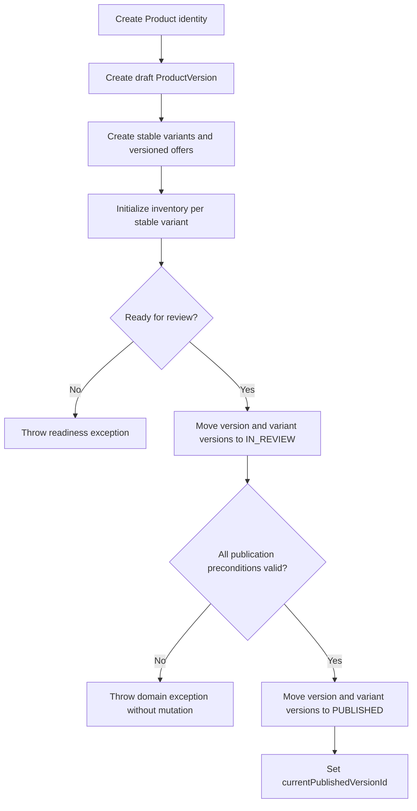
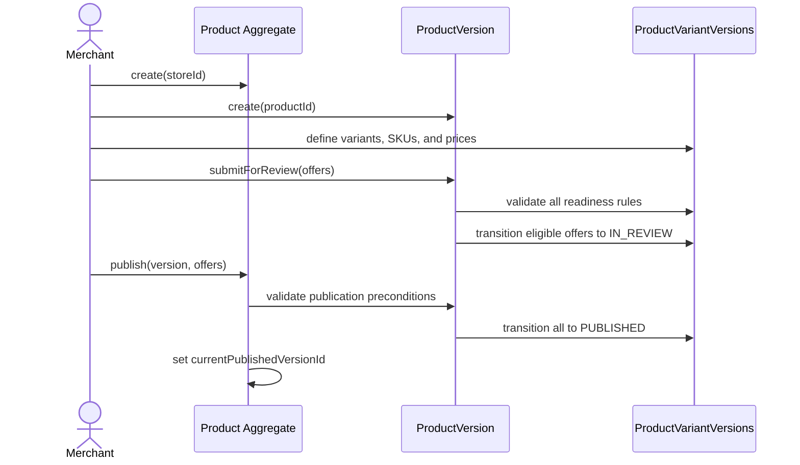
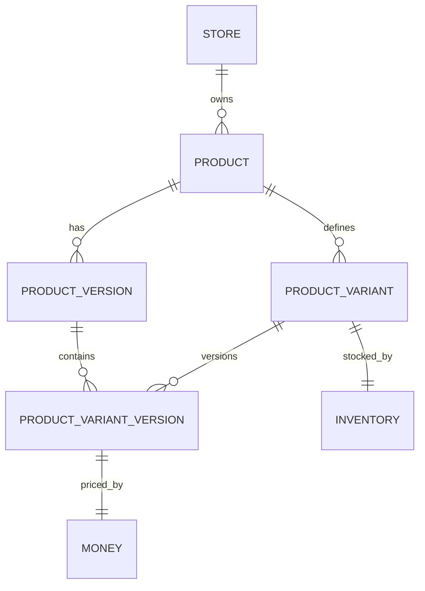

# Feature Specification: Product Publication Lifecycle Domain Slice

## Document Control

- **Status:** Draft
- **Feature slug:** `product-publication-lifecycle`
- **Branch:** `feature/product_lifecycle`
- **Intake:** [intake.md](./intake.md)
- **Relevant source docs:** [MVP scope](../../docs/md/01_mvp_scope.md), [transactions and state](../../docs/md/05_transactions_and_state.md), [implementation roadmap](../../docs/md/06_implementation_roadmap.md), [testing plan](../../docs/md/07_testing_plan.md), [class model](../../docs/diagrams/class.mmd)
- **Owners:** User - product decisions; Agent - specification, tests, and implementation

## 1. Goal and Scope

### Goal

Define and test the smallest infrastructure-free domain slice that lets a merchant create a product and its first complete version, define versioned variants with inventory, submit it for review, and publish it.

### In Scope

- Product identity associated with a Store.
- ProductVersion content and lifecycle.
- Stable ProductVariant identity separated from ProductVariantVersion sellable data.
- Money price stored directly on ProductVariantVersion.
- One Inventory record per stable ProductVariant.
- Aggregate readiness validation before submission.
- Coordinated publication of ProductVersion and its ProductVariantVersions.
- Product.currentPublishedVersionId assignment after successful publication.
- Plain Java domain exceptions and JUnit unit tests.

### Out of Scope

- API, application service, persistence, transactions, security, frontend, and external integrations.
- Separate ProductPrice history or scheduled pricing.
- Additional lifecycle paths beyond first-version submission and publication.
- Publication of a second version and superseding the first.
- Storefront query implementation.

### Assumptions

- Product is a stable identity and does not carry publication state.
- ProductVersion owns mutable catalog presentation data such as name, description, category, and media references.
- ProductVariant is stable identity under Product.
- ProductVariantVersion belongs to both a ProductVariant and a ProductVersion and owns versioned SKU, display name, price, and publication status.
- Money price on ProductVariantVersion is sufficient for Week 1; separate price history is deferred.
- Inventory belongs to stable ProductVariant and is lifecycle-independent.
- An active variant means its ProductVariant identity is `ACTIVE` and its entry in the submitted ProductVersion is eligible for submission.
- Readiness requires a non-blank name, description, category ID, and at least one active variant version with a unique non-blank SKU and strictly positive Money price.

### Open Questions

- Whether later work must implement all additional lifecycle transitions already listed in `docs/md/05_transactions_and_state.md`.
- Whether future versions reuse stable variants and inventory or may introduce new stable variants.

## 2. User Stories

| ID | Priority | Story |
|---|---|---|
| US-01 | Must | As a merchant, I want to create a product identity for my store so that versioned catalog content has a stable parent. |
| US-02 | Must | As a merchant, I want to draft product content and variant offers so that edits do not affect published catalog data. |
| US-03 | Must | As a merchant, I want to initialize inventory independently so that stocking does not alter publication state. |
| US-04 | Must | As a merchant, I want incomplete versions rejected at submission so that only sellable content enters review. |
| US-05 | Must | As a merchant, I want an approved version published atomically in the domain model so that the product points to a coherent published version. |

## 3. Acceptance Criteria

| ID | Story | Criterion |
|---|---|---|
| AC-01 | US-01 | Given Store S1, when Product P1 is created, then P1 records S1 and has a null currentPublishedVersionId with no publication status. |
| AC-02 | US-02 | Given P1, when V1 is created, then V1 records P1 and starts in `DRAFT`. |
| AC-03 | US-02 | Given V1 in `DRAFT`, when its versioned attributes are edited, then name, description, category, and media references are updated without changing Product state. |
| AC-04 | US-02 | Given P1 and V1, when a variant is defined, then ProductVariant provides stable identity while ProductVariantVersion records V1-specific SKU, name, Money price, and `DRAFT` status. |
| AC-05 | US-03 | Given an active ProductVariant, when Inventory is initialized with a non-negative quantity, then it references that variant and does not change Product or ProductVersion state. |
| AC-06 | US-03 | Given a ProductVariant that already has Inventory, when another Inventory is associated in the same domain graph, then the one-record-per-variant invariant is rejected. |
| AC-07 | US-04 | Given a complete V1 with at least one active valid variant version, when V1 is submitted, then V1 and all included eligible variant versions move from `DRAFT` to `IN_REVIEW`. |
| AC-08 | US-04 | Given missing required content, no active variant, a blank or duplicate SKU, or an invalid price, when V1 is submitted, then a readiness domain exception identifies the reason and no lifecycle state changes. |
| AC-09 | US-05 | Given V1 and all included variant versions are `IN_REVIEW`, when V1 is published, then they move to `PUBLISHED` and P1.currentPublishedVersionId becomes V1.id. |
| AC-10 | US-05 | Given any state other than the required source state, when submit or publish is requested, then an illegal-transition domain exception is thrown and the aggregate remains unchanged. |
| AC-11 | US-02 | Given identifiers from mismatched products or versions, when entities are associated, then an ownership domain exception is thrown. |
| AC-12 | US-05 | Given publication validation fails for any included variant version, when publish is requested, then neither parent nor child state nor Product.currentPublishedVersionId changes. |

## 4. Functional Flow

### Main Flow

1. Create Product P1 with storeId S1.
2. Create ProductVersion V1 with productId P1 and status `DRAFT`.
3. Set V1 name, description, category, media references, and other versioned attributes.
4. Create stable ProductVariant A and B identities under P1.
5. Add ProductVariantVersion A1 and B1 under V1 with unique SKUs and positive Money prices.
6. Initialize Inventory A and B against their stable variant identities.
7. Validate the complete V1 aggregate and submit it for review.
8. Validate all required source states and publish V1.
9. Set P1.currentPublishedVersionId to V1.id only after all publication preconditions succeed.

### Decision and Failure Flow

## 5. Cross-Component Sequence

This slice has one domain component and no infrastructure boundary.

## 6. API Contract

N/A.
This is deliberately an infrastructure-free domain slice, and no endpoint or OpenAPI change is authorized.

## 7. Data Model and Migration

- **Entities/value objects modeled:** Product, ProductVersion, ProductVariant, ProductVariantVersion, Inventory, Money.
- **Tenant ownership:** Tenant isolation is represented indirectly through Product.storeId ownership in this slice; service-layer tenant enforcement is deferred.
- **Constraints/indexes:** Domain invariants require unique SKU per ProductVersion and one Inventory per ProductVariant; database constraints are deferred.
- **Flyway migration:** N/A.
- **Existing-data/backfill behavior:** N/A.
- **Rollback/recovery considerations:** N/A without persistence; aggregate methods validate all preconditions before mutation.

## 8. State and Transaction Model

| Aggregate/entity | From | Trigger | Guard | To | Side effects |
|---|---|---|---|---|---|
| ProductVersion and included ProductVariantVersions | `DRAFT` | Submit for review | Required content exists; at least one active variant exists; all included active offers have unique valid SKUs and valid prices | `IN_REVIEW` | None outside the aggregate graph |
| ProductVersion and included ProductVariantVersions | `IN_REVIEW` | Publish first version | Parent and every included eligible child are `IN_REVIEW`; identifiers and ownership match | `PUBLISHED` | Product.currentPublishedVersionId is set to the version ID |

- **Transaction boundary:** No database transaction exists; one aggregate-level command performs preflight validation before any in-memory mutation.
- **Invalid transitions:** Throw a dedicated IllegalLifecycleTransitionException carrying entity type, identifier, source state, and attempted action.
- **Concurrency/idempotency:** Repeated operations are rejected as illegal transitions; cross-process concurrency is deferred to persistence work.
- **Recovery:** Failed validation leaves every involved object unchanged.

## 9. Security and Tenant Isolation

- **Authentication:** N/A.
- **RBAC:** N/A at the domain layer.
- **Ownership/tenant checks:** ProductVersion.productId, ProductVariant.productId, and ProductVariantVersion parent identifiers must match the aggregate graph; Inventory.productVariantId must match its stable variant.
- **Sensitive data/files:** Only opaque media references are modeled; file access is out of scope.
- **Abuse/validation concerns:** Reject null identifiers, blank required text, invalid Money, negative inventory, duplicate SKUs, and mismatched ownership.

## 10. Frontend Behavior

N/A.
No user-facing surface is included in this domain-only slice.

## 11. Observability and Operations

- **Logs:** N/A in pure domain objects.
- **Metrics/health:** N/A.
- **Mock/local mode:** N/A.
- **Smoke verification:** N/A because no runnable application boundary is changed.

## 12. Test Plan and Traceability

### Coverage Summary

- The JUnit suite maps tests to every acceptance criterion from AC-01 through AC-12.
- The suite contains 17 test methods and 30 planned cases after expanding parameterized inputs.
- All tests are isolated unit tests using JUnit 5 and AssertJ.
- The suite does not load Spring, use mocks, connect to a database, or invoke external infrastructure.
- The test source is `backend/marketplace-service/src/test/java/com/example/marketplace/product/ProductPublicationLifecycleTest.java`.
- Integration, end-to-end, and smoke tests are not applicable to this infrastructure-free slice.
- Execution is currently unverified because the production types and APIs required by the contract tests are incomplete.

### Test Cases

| Test ID | Acceptance criteria | Test method or case | Case description | Expected behavior |
|---|---|---|---|---|
| UT-01 | AC-01 | `ac01_createProductRetainsStoreOwnershipWithoutPublicationState` | Create Product P1 for Store S1. | Product retains its ID, store ID, and product code; currentPublishedVersionId is empty; Product exposes no publication state. |
| UT-02 | AC-02 | `ac02_createFirstProductVersionStartsInDraft` | Create the first ProductVersion V1 for P1. | V1 retains its ID, product ID, and version number and starts in `DRAFT`. |
| UT-03 | AC-03 | `ac03_editVersionedDetailsDoesNotChangeProductIdentity` | Update V1 name, description, category, and media references. | V1 contains the edited values and remains `DRAFT`; Product identity and currentPublishedVersionId remain unchanged. |
| UT-04 | AC-04 | `ac04_stableVariantIdentityIsSeparatedFromVersionedOfferData` | Create stable variant BLACK-S and its V1 ProductVariantVersion offer. | ProductVariant retains stable product identity and `ACTIVE` status; ProductVariantVersion owns V1, SKU, display name, Money price, and `DRAFT` publication status. |
| UT-05A | AC-05 | `ac05_initializeInventoryDoesNotChangeVariantOrVersionLifecycle[0]` | Initialize inventory with zero available units. | Inventory references the stable variant and contains zero; ProductVariant remains `ACTIVE`; ProductVersion remains `DRAFT`. |
| UT-05B | AC-05 | `ac05_initializeInventoryDoesNotChangeVariantOrVersionLifecycle[20]` | Initialize inventory with 20 available units. | Inventory references the stable variant and contains 20; ProductVariant remains `ACTIVE`; ProductVersion remains `DRAFT`. |
| UT-06 | AC-05 | `ac05_negativeInitialInventoryIsRejected` | Initialize inventory with -1 available units. | `IllegalArgumentException` is thrown and identifies `availableQuantity`. |
| UT-07 | AC-06 | `ac06_secondInventoryForTheSameVariantIsRejected` | Initialize inventory twice for BLACK-S. | `DuplicateInventoryException` is thrown and identifies the stable variant; the original returned Inventory retains its variant ID and quantity. |
| UT-08 | AC-07 | `ac07_submitCompleteVersionMovesParentAndOffersToInReview` | Submit complete V1 with active BLACK-S and BLACK-M offers. | V1 and both ProductVariantVersions move from `DRAFT` to `IN_REVIEW`. |
| UT-09A | AC-08 | `ac08_submitRejectsIncompleteVersionWithoutPartialStateChange[missing name]` | Submit V1 without a name. | `ProductReadinessException` reports `MISSING_NAME`; V1 and all offers remain `DRAFT`. |
| UT-09B | AC-08 | `ac08_submitRejectsIncompleteVersionWithoutPartialStateChange[missing description]` | Submit V1 with a blank description. | `ProductReadinessException` reports `MISSING_DESCRIPTION`; V1 and all offers remain `DRAFT`. |
| UT-09C | AC-08 | `ac08_submitRejectsIncompleteVersionWithoutPartialStateChange[missing category]` | Submit V1 without a category ID. | `ProductReadinessException` reports `MISSING_CATEGORY`; V1 and all offers remain `DRAFT`. |
| UT-09D | AC-08 | `ac08_submitRejectsIncompleteVersionWithoutPartialStateChange[no active variant]` | Submit V1 when its only ProductVariant is discontinued. | `ProductReadinessException` reports `NO_ACTIVE_VARIANT`; V1 and its offer remain `DRAFT`. |
| UT-09E | AC-08 | `ac08_submitRejectsIncompleteVersionWithoutPartialStateChange[no variants or offers]` | Submit V1 with empty variant and offer collections. | `ProductReadinessException` reports `NO_ACTIVE_VARIANT`; V1 remains `DRAFT`. |
| UT-09F | AC-08 | `ac08_submitRejectsIncompleteVersionWithoutPartialStateChange[blank SKU]` | Submit V1 with a blank SKU. | `ProductReadinessException` reports `INVALID_SKU`; V1 and its offer remain `DRAFT`. |
| UT-09G | AC-08 | `ac08_submitRejectsIncompleteVersionWithoutPartialStateChange[duplicate SKU]` | Submit V1 with case-insensitive duplicate SKU values `BLACK` and `black`. | `ProductReadinessException` reports `DUPLICATE_SKU`; V1 and both offers remain `DRAFT`. |
| UT-09H | AC-08 | `ac08_submitRejectsIncompleteVersionWithoutPartialStateChange[zero price]` | Submit V1 with a zero Money price. | `ProductReadinessException` reports `INVALID_PRICE`; V1 and its offer remain `DRAFT`. |
| UT-09I | AC-08 | `ac08_submitRejectsIncompleteVersionWithoutPartialStateChange[negative price]` | Submit V1 with a negative Money price. | `ProductReadinessException` reports `INVALID_PRICE`; V1 and its offer remain `DRAFT`. |
| UT-09J | AC-08 | `ac08_submitRejectsIncompleteVersionWithoutPartialStateChange[null price]` | Submit V1 with a null price. | `ProductReadinessException` reports `INVALID_PRICE`; V1 and its offer remain `DRAFT`. |
| UT-10 | AC-09 | `ac09_publishInReviewVersionPublishesOffersAndUpdatesProductPointer` | Publish complete V1 after successful submission. | V1 and both offers become `PUBLISHED`; Product.currentPublishedVersionId contains V1.id. |
| UT-11A | AC-10 | `ac10_submitOutsideDraftIsRejectedWithoutMutation` | Submit V1 again while it is already `IN_REVIEW`. | `IllegalLifecycleTransitionException` identifies the state and action; V1 and both offers remain `IN_REVIEW`. |
| UT-11B | AC-10 | `ac10_submitPublishedVersionIsRejectedWithoutMutation` | Submit V1 after it has been published. | `IllegalLifecycleTransitionException` identifies `PUBLISHED` and submit; V1 and its offers remain `PUBLISHED`; the product pointer remains V1.id. |
| UT-11C | AC-10 | `ac10_submitRejectsChildOutsideDraftWithoutMutation` | Submit a draft parent with included offers already in `IN_REVIEW`. | `IllegalLifecycleTransitionException` is thrown; the parent remains `DRAFT` and all offers remain `IN_REVIEW`. |
| UT-12A | AC-10 | `ac10_publishOutsideInReviewIsRejectedWithoutMutation` | Publish V1 while it is still `DRAFT`. | `IllegalLifecycleTransitionException` identifies the state and action; V1 and all offers remain `DRAFT`; Product.currentPublishedVersionId remains empty. |
| UT-12B | AC-10 | `ac10_repeatedPublishIsRejectedWithoutMutation` | Publish V1 again after successful publication. | `IllegalLifecycleTransitionException` identifies `PUBLISHED` and publish; V1 and all offers remain `PUBLISHED`; the product pointer remains V1.id. |
| UT-13A | AC-11 | `ac11_mismatchedOwnershipIsRejected[product version belongs to another product]` | Publish a ProductVersion whose productId belongs to another Product. | `OwnershipMismatchException` is thrown. |
| UT-13B | AC-11 | `ac11_mismatchedOwnershipIsRejected[variant belongs to another product]` | Submit V1 with a ProductVariant owned by another Product. | `OwnershipMismatchException` is thrown. |
| UT-13C | AC-11 | `ac11_mismatchedOwnershipIsRejected[offer belongs to another product version]` | Submit V1 with a ProductVariantVersion owned by another ProductVersion. | `OwnershipMismatchException` is thrown. |
| UT-13D | AC-11 | `ac11_mismatchedOwnershipIsRejected[offer references a variant outside the submitted aggregate]` | Submit V1 with an offer whose ProductVariant identifier is absent from the supplied variant graph. | `OwnershipMismatchException` is thrown. |
| UT-14 | AC-12 | `ac12_failedChildPublicationLeavesTheWholeAggregateUnchanged` | Attempt publication with V1 and two offers in `IN_REVIEW` plus one included offer still in `DRAFT`. | `IllegalLifecycleTransitionException` is thrown; V1 and existing offers remain `IN_REVIEW`; the invalid offer remains `DRAFT`; Product.currentPublishedVersionId remains empty. |

### Static Coverage Evaluation

The test contract maps at least one case to every acceptance criterion from AC-01 through AC-12.
The added cases close the most direct gaps in empty-input readiness, null-price readiness, invalid lifecycle source states, duplicate publication, child-state preflight, and offer-to-variant ownership.
Assertions were also strengthened for draft-edit isolation, versioned display name ownership, inventory preservation, and unchanged child states after rejected publication.
This evaluation is static and does not claim that any case compiles, fails for the intended reason, or passes.

| Coverage area | Assessment after additions | Evidence |
|---|---|---|
| Product identity and first version | Strong behavioral coverage with one structural follow-up | AC-01 and AC-02 cover stable ownership, initial pointer state, version identity, version number, and initial `DRAFT` state; absence of a Product publication-status property remains an architecture check. |
| Draft content isolation | Strong | AC-03 now asserts edited version fields, unchanged `DRAFT` state, stable Product identity, and an unchanged publication pointer. |
| Stable variant versus versioned offer | Strong | AC-04 now asserts stable variant ownership and status plus version-specific SKU, display name, Money price, parents, and `DRAFT` state. |
| Inventory initialization | Strong with one follow-up | AC-05 covers zero, positive, and negative quantities plus unchanged lifecycle state; AC-06 rejects a second initialization and preserves the original returned inventory. |
| Submission readiness | Strong with one product decision pending | AC-07 covers the complete transition; AC-08 covers missing content, empty collections, inactive variants, invalid and duplicate SKUs, and null, zero, or negative prices without partial mutation. |
| Publication | Strong | AC-09 covers successful publication and pointer assignment; AC-12 proves full preflight when a later included child is invalid. |
| Invalid transitions and retries | Strong | AC-10 covers submission from `IN_REVIEW` and `PUBLISHED`, publication from `DRAFT` and `PUBLISHED`, and a child outside the required submission source state. |
| Ownership chain | Strong with one follow-up | AC-11 covers wrong Product, wrong ProductVersion, wrong ProductVariant ownership, and an offer referencing a variant outside the supplied graph. |

### Additional Recommended Cases

These cases remain useful but require an API or product decision before they can be expressed as stable executable contracts.

| Priority | Related rule | Additional case | Reason not added now |
|---|---|---|---|
| High | AC-08 and Money validity | Reject a Money value without currency. | The artifacts do not yet decide whether Money construction rejects it immediately or submission reports `INVALID_PRICE`. |
| High | AC-11 and inventory ownership | Reject Inventory associated with a different stable ProductVariant. | The intended Inventory construction or association API is not yet defined. |
| Medium | Identifier validation | Reject null Product, Store, ProductVersion, ProductVariant, offer, and category identifiers at their defined boundaries. | Stable exception types and failure boundaries are not specified for each constructor. |
| Medium | Required text validation | Reject blank product code, variant code, and versioned display name where those fields are mandatory. | The current acceptance criteria define readiness text but do not define all identity-field validation reasons. |
| Medium | SKU normalization | Decide whether `BLACK-S` and whitespace-padded equivalents are duplicates. | Case-insensitive uniqueness is specified, but whitespace normalization is not. |
| Medium | Collection ownership | Verify that media-reference inputs are defensively copied and cannot mutate ProductVersion after update. | Mutability semantics are not stated in the current business requirements. |
| Low | Performance constraint | Submit a large deterministic offer collection and guard against quadratic duplicate-SKU validation. | A stable size or performance budget is not specified, so exact timing assertions would be brittle. |
| Structural | AC-01 | Verify that Product exposes no publication-status property. | This is an API-shape rule better enforced by architecture inspection than by behavioral unit assertions. |

### Excluded Test Layers

| Test ID | Layer | Coverage | Reason |
|---|---|---|---|
| IT-N/A | Integration | N/A | No Spring, persistence, API, transaction, security, or external-adapter boundary is included. |
| E2E-N/A | End-to-end | N/A | No frontend or running user journey is included. |
| ST-N/A | Smoke | N/A | No deployable application behavior is changed by this domain-only slice. |

## 13. Implementation Work Breakdown

| Order | Work item | Owner | Depends on | Done when |
|---|---|---|---|---|
| 1 | Approve assumptions and lifecycle boundary | User + Agent | This draft | Decisions are recorded |
| 2 | Add failing domain tests for identity, ownership, value validation, readiness, atomic failure, and transitions | Agent | Approved specification | Tests fail for the intended missing behavior |
| 3 | Implement Money, domain exception types, and entity invariants | Agent | Failing value and ownership tests | Focused tests pass |
| 4 | Implement Product and ProductVersion responsibilities | Agent | Failing lifecycle tests | Parent lifecycle tests pass |
| 5 | Implement ProductVariant, ProductVariantVersion, and Inventory separation | Agent | Failing variant and inventory tests | Separation and invariants pass |
| 6 | Implement aggregate submission and first publication orchestration | Agent | Entity behavior | Full domain lifecycle suite passes |
| 7 | Run the affected backend test suite | Agent | Green focused tests | Current command output confirms success |

## 14. Definition of Done

- [ ] The specification and assumptions are approved.
- [ ] Product has identity and current-published-version responsibility but no publication lifecycle status.
- [ ] ProductVersion owns versioned product content and its lifecycle.
- [ ] ProductVariant identity and ProductVariantVersion content/lifecycle are separate.
- [ ] Money price is held directly by ProductVariantVersion.
- [ ] One Inventory record per ProductVariant is enforced in the domain model.
- [ ] `DRAFT` to `IN_REVIEW` and `IN_REVIEW` to `PUBLISHED` are implemented for ProductVersion and included ProductVariantVersions.
- [ ] Illegal transitions throw domain exceptions without partial mutation.
- [ ] One ProductVersion can be published.
- [ ] Product.currentPublishedVersionId points to that published version.
- [ ] All planned domain lifecycle tests pass without Spring, JPA, Oracle, Redis, or RabbitMQ.
- [ ] No out-of-scope behavior was added.

## 15. Decision and Deviation Log

| Date | Decision/deviation | Reason | Approved by | Affected AC/tests |
|---|---|---|---|---|
| 2026-08-10 | Store price as Money on ProductVariantVersion, not in a separate ProductPrice entity | Week 1 does not require independent price history, and price is versioned offer data | Pending user approval | AC-04, AC-08; UT-03, UT-09 |
| 2026-08-10 | Keep Inventory on stable ProductVariant identity | Inventory lifecycle must remain independent from ProductVersion publication | Pending user approval | AC-05, AC-06; UT-04, UT-05, UT-06 |
| 2026-08-10 | Limit implemented lifecycle paths to first-version submit and publish | Matches the requested exit criteria while preserving the documented larger state model for later slices | Pending user approval | AC-07, AC-09, AC-10; UT-07, UT-10, UT-11 |
