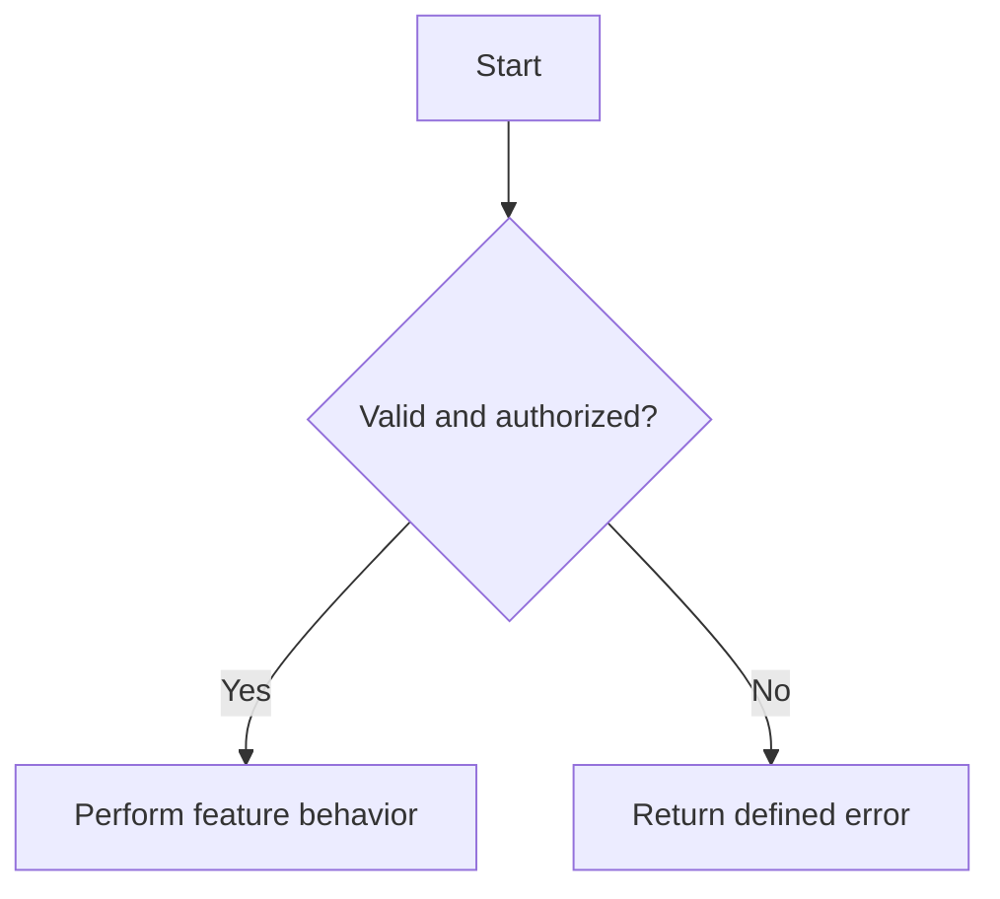
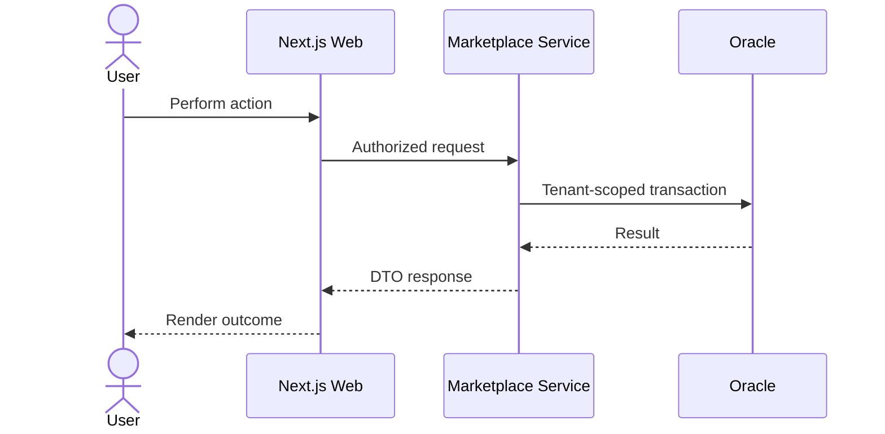

# Feature Specification: <Feature Name>

## Document Control

- **Status:** Draft | Approved | Implementing | Complete
- **Feature slug:** <slug>
- **Branch:** <branch>
- **Intake:** [intake.md](./intake.md)
- **Relevant source docs:** <links into docs/md>
- **Owners:** User — product decisions; Agent — specification, tests, implementation

## 1. Goal and Scope

### Goal

<User/business outcome.>

### In Scope

- <behavior>

### Out of Scope

- <non-goal>

### Assumptions

- <assumption, or None>

### Open Questions

- <blocking question and owner, or None>

## 2. User Stories

| ID | Priority | Story |
|---|---|---|
| US-01 | Must | As a <role>, I want <capability>, so that <outcome>. |

## 3. Acceptance Criteria

| ID | Story | Criterion |
|---|---|---|
| AC-01 | US-01 | Given <context>, when <action>, then <observable result>. |

Include positive behavior, validation, permissions, tenant isolation, empty
states, dependency failures, retry/idempotency behavior, and transaction
failure where relevant.

## 4. Functional Flow

### Main Flow

1. <step>

### Decision and Failure Flow

## 5. Cross-Component Sequence

Remove or adapt participants that do not apply. Show authorization,
transaction, integration-failure, and retry boundaries when relevant.

## 6. API Contract

For each endpoint specify method/path, caller, authorization, request DTO,
validation, response DTO, status/error responses, idempotency, and compatibility.
Update `marketplace-api.yaml` when the contract changes.

| Method and path | Auth | Request | Success | Errors |
|---|---|---|---|---|
| `<METHOD /api/v1/...>` | `<ROLE>` | `<DTO>` | `<status, DTO>` | `<status, condition>` |

## 7. Data Model and Migration

- **Entities/tables changed:** <list or None>
- **Tenant ownership:** <tenant_id rules>
- **Constraints/indexes:** <unique, foreign-key, lookup needs>
- **Flyway migration:** <planned filename/purpose or None>
- **Existing-data/backfill behavior:** <plan>
- **Rollback/recovery considerations:** <plan>

Add a Mermaid ERD when relationships change materially.

## 8. State and Transaction Model

| From | Trigger | Guard/permission | To | Side effects |
|---|---|---|---|---|
| <state> | <event> | <rule> | <state> | <effect> |

- **Transaction boundary:** <operations that commit or roll back together>
- **Invalid transitions:** <behavior>
- **Concurrency/idempotency:** <behavior>
- **Recovery:** <behavior after interruption or dependency failure>

## 9. Security and Tenant Isolation

- **Authentication:** <requirement>
- **RBAC:** <allowed and denied roles>
- **Ownership/tenant checks:** <service-layer rule>
- **Sensitive data/files:** <exposure and access rule>
- **Abuse/validation concerns:** <limits or validation>

## 10. Frontend Behavior

- **Routes/components:** <affected surfaces or None>
- **Typed API client changes:** <changes>
- **States:** <loading, empty, success, validation, error>
- **Accessibility/manual checks:** <checks>

## 11. Observability and Operations

- **Logs:** <useful events without secrets>
- **Metrics/health:** <requirements or None>
- **Mock/local mode:** <behavior or None>
- **Smoke verification:** <minimal runnable path>

## 12. Test Plan and Traceability

| Test ID | Layer | Acceptance criteria | Scenario | Expected result | Location/fixture |
|---|---|---|---|---|---|
| UT-01 | Unit | AC-01 | <isolated rule> | <result> | <planned path> |
| IT-01 | Integration | AC-01 | <DB/API/security behavior> | <result> | <planned path> |
| E2E-01 | E2E | AC-01 | <critical user journey> | <result> | <planned path> |
| ST-01 | Smoke | AC-01 | <startup/minimal path> | <result> | <planned path> |

Record `N/A` with a reason when a test layer does not apply. Test names should
contain their test ID or acceptance-criteria ID.

## 13. Implementation Work Breakdown

| Order | Work item | Owner | Depends on | Done when |
|---|---|---|---|---|
| 1 | Resolve specification questions | User + Agent | Intake | Decisions recorded |
| 2 | Add failing tests and fixtures | Agent | Approved spec | Expected failures verified |
| 3 | Add migration/persistence changes | Agent | Tests | Relevant tests pass |
| 4 | Add backend/API behavior | Agent | Persistence | Unit/integration tests pass |
| 5 | Add frontend flow | Agent + User review | API | E2E behavior passes |
| 6 | Run regression and smoke checks | Agent | Implementation | Required suites pass |

## 14. Definition of Done

- [ ] Specification and acceptance criteria are approved.
- [ ] Backend API and authorization work.
- [ ] Tenant isolation is enforced in the service layer.
- [ ] Required Flyway migration exists.
- [ ] Applicable unit, integration, E2E, and smoke tests pass.
- [ ] User-facing frontend calls the typed API client.
- [ ] Error and extreme cases are handled.
- [ ] Contracts and relevant documentation are updated.
- [ ] No Marketplace MVP scope or architecture rule was violated.

## 15. Decision and Deviation Log

| Date | Decision/deviation | Reason | Approved by | Affected AC/tests |
|---|---|---|---|---|
| <date> | <decision> | <reason> | <owner> | <IDs> |
