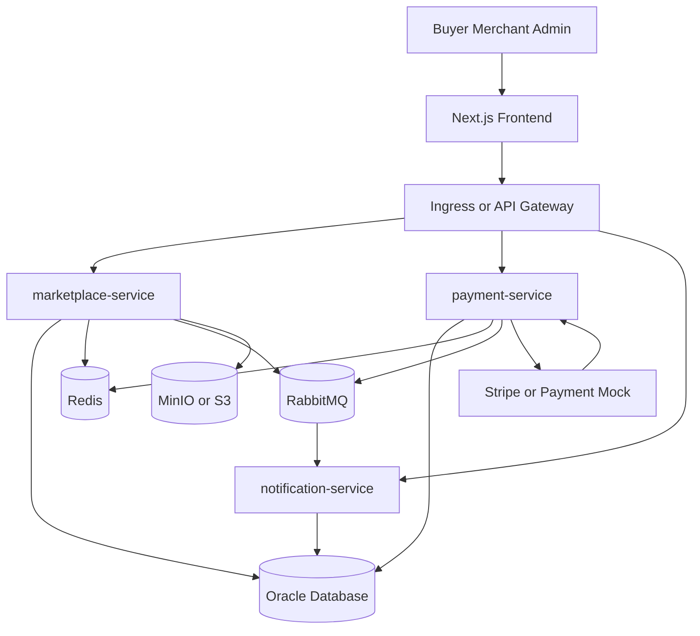

# System Architecture

## Architecture Overview

The system uses a three-tier web architecture with a minimal service split.



## Services

### marketplace-service

Primary service for core business operations.

Responsibilities:

- User role lookup
- Store management
- Tenant isolation
- Product management
- Category management
- Storefront product browsing
- Search and filtering
- Cart management
- Order creation
- Buyer library
- Review management
- Admin management
- Secure download URL generation

### payment-service

Service for payment operations.

Responsibilities:

- Payment session creation
- Platform fee calculation
- Payment status tracking
- Payment webhook verification
- Idempotent webhook processing
- Publish payment events to RabbitMQ

### notification-service

Service for async notification workflows.

Responsibilities:

- Consume RabbitMQ events
- Create in-app notifications
- Optional email notification later

## Shared Infrastructure

| Component | Purpose |
|---|---|
| Oracle Database | Source of truth for users, stores, products, orders, payments, reviews, and access grants. |
| Redis | Cache public storefront, category, product detail, and rate limiting counters. |
| RabbitMQ | AMQP-based async event delivery. |
| MinIO or S3 | Store product images and private digital files. |
| GitHub Actions | CI pipeline. |
| Docker Compose | Local runtime. |
| Kubernetes or Minikube | Later deployment validation. |

## Communication Patterns

### Synchronous Communication

Use REST over HTTP for frontend to backend communication.

Examples:

- Search products
- Create product
- Add item to cart
- Create checkout session
- View library
- Submit review

### Asynchronous Communication

Use RabbitMQ for background side effects.

Events:

| Event | Producer | Consumer |
|---|---|---|
| payment.succeeded | payment-service | marketplace-service, notification-service |
| payment.failed | payment-service | notification-service |
| product.published | marketplace-service | notification-service |
| review.created | marketplace-service | notification-service |
| order.completed | marketplace-service | notification-service |

## Tenant Isolation Strategy

Use shared Oracle database and shared schema with `tenant_id` on tenant-owned tables.

Tenant-owned tables include:

- stores
- merchant_memberships
- products
- product_media
- product_files
- order_items
- access_grants
- reviews

Rules:

- Merchant-facing queries must filter by tenant ID.
- Merchant product updates must check tenant ownership.
- Admin APIs may perform cross-tenant operations only with ADMIN role.

## Caching Strategy

Use Redis only as a cache, not as source of truth.

Cache keys:

| Key Pattern | Data |
|---|---|
| `store:{storeSlug}` | Store profile |
| `store:{storeSlug}:products:{hash}` | Store product listing |
| `product:{productId}` | Product detail |
| `categories:active` | Active category list |
| `search:{hash}` | Search results |

Invalidate cache on:

- Product created
- Product updated
- Product published
- Product unpublished
- Product suspended
- Review created
- Category updated

## Deployment View

Local MVP:

```text
Next.js frontend
Spring Boot services
Oracle container
Redis container
RabbitMQ container
MinIO container
```

Kubernetes later:

```text
Deployment
Service
Ingress
ConfigMap
Secret
PersistentVolumeClaim for local MinIO or Oracle dev only
```
