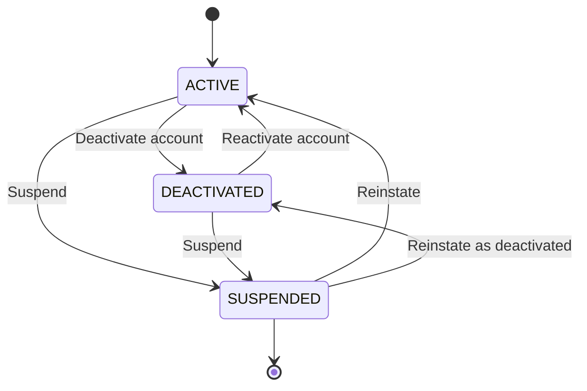
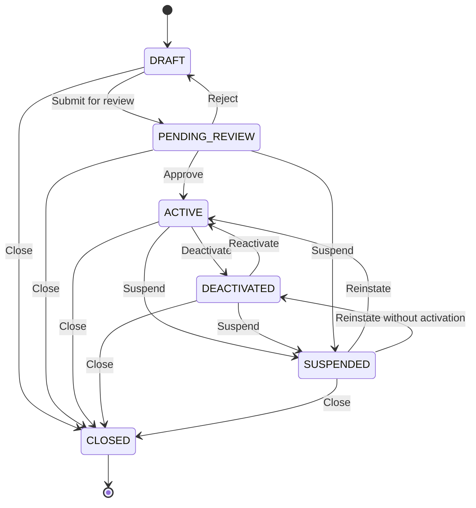
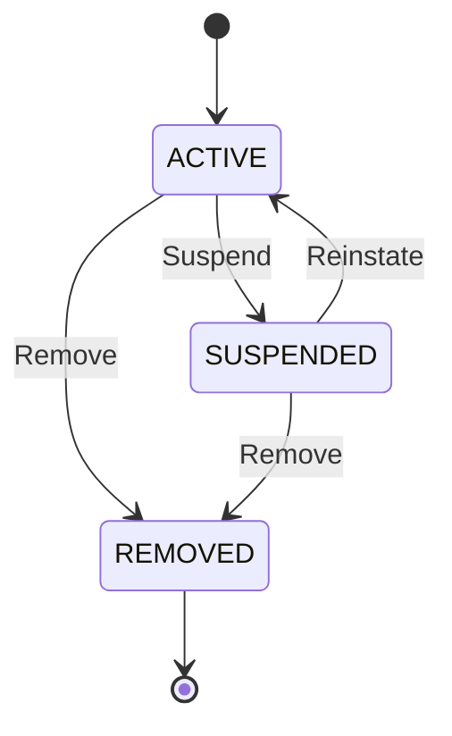
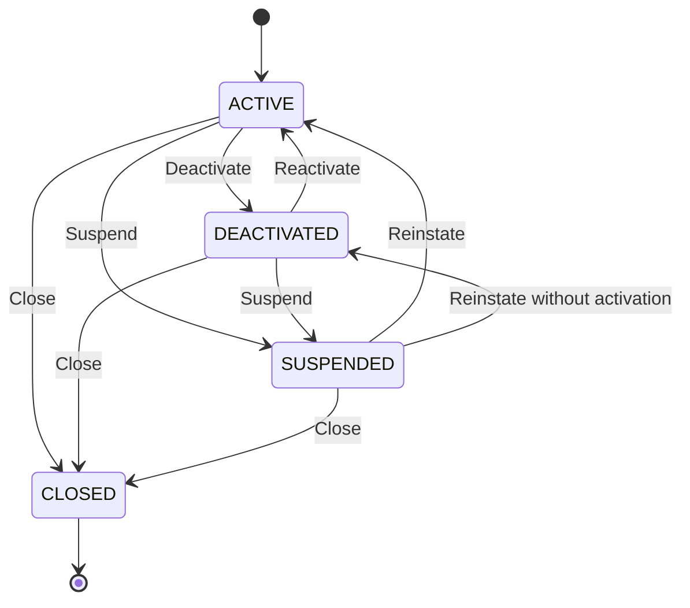
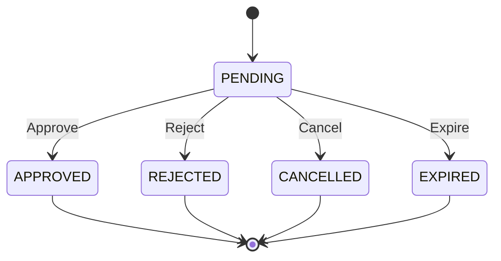
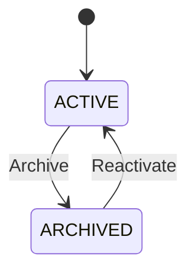
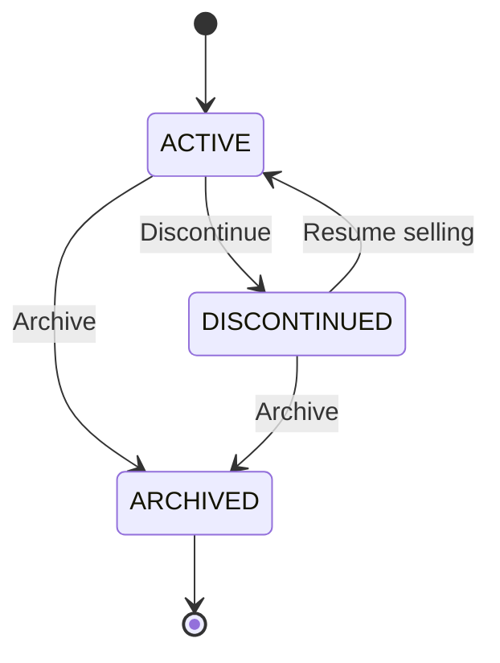
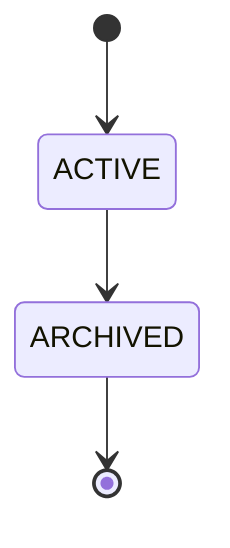
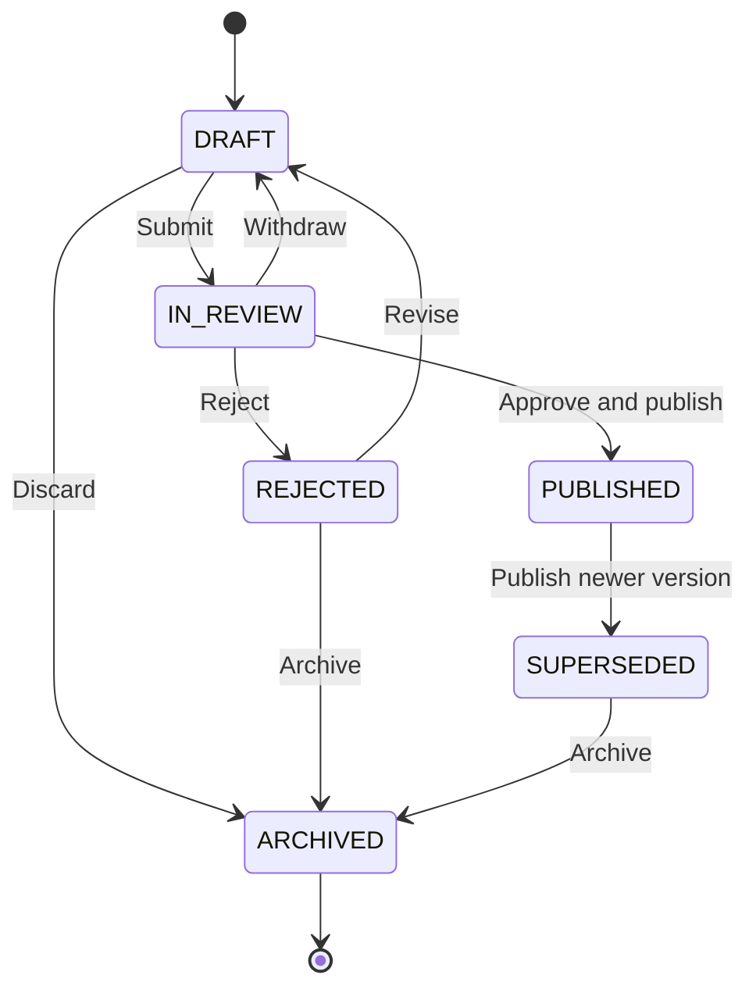
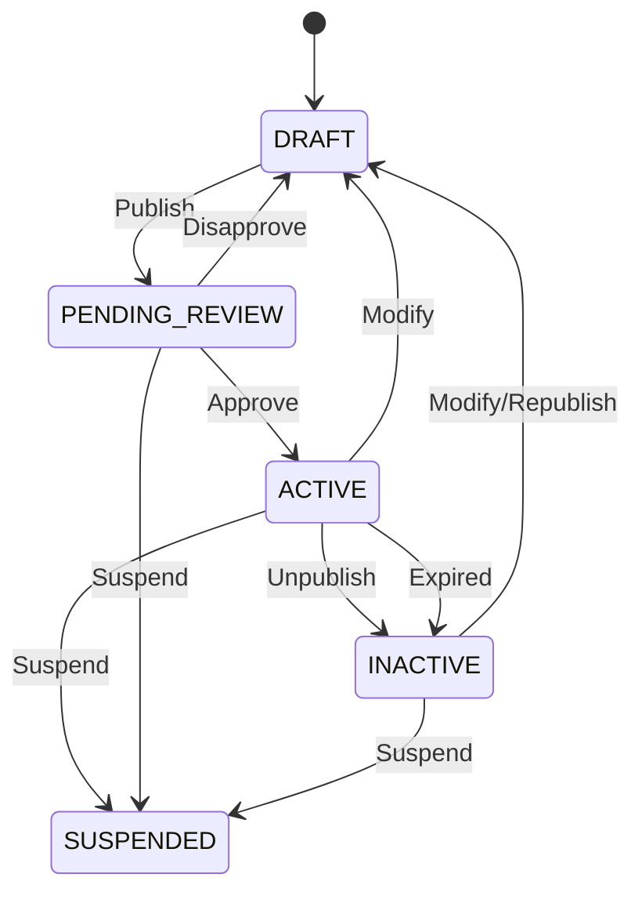

# Transactions and State Design

## Stateful entity
1. User management
- User (`ACTIVE/INACTIVE/SUSPENDED`)

2. Store
- Store (`DRAFT/ACTIVE/INACTIVE/PENDING_REVIEW/SUSPENDED/CLOSED`)

- Store Membership (`ACTIVE/SUSPENDED/REMOVED`)

3. Tenant

- Tenant (`ACTIVE/INACTIVE/SUSPENDED/CLOSED`)

- Tenant Membership (`ACTIVE/SUSPENDED/REMOVED`)

- TenantInvitation (`PENDING/APPROVED/REJECTED/CANCELLED/EXPIRED`)

- TenantVerification (`PENDING/APPROVED/CANCELLED/EXPIRED`)

4. Role
- Role (`ACTIVE/ARCHIVED`)

5. Product
- Product (`ACTIVE/DISCONTINUED/ARCHIVED`)

- ProductCategory (`ACTIVE/ARCHIVED`)

- ProductVersion (`DRAFT/IN_REVIEW/ACTIVE/INACTIVE/ARCHIVED/SUSPENDED`)

- ProductVariant (`ACTIVE/DISCONTINUED/ARCHIVED`)

- ProductVersionPrice (`SCHEDULED/ACTIVE/EXPIRED/CANCELLED`)
