# State Design

## State Machines

### 1. User Management

#### User

States: `ACTIVE`, `INACTIVE`, `SUSPENDED`.

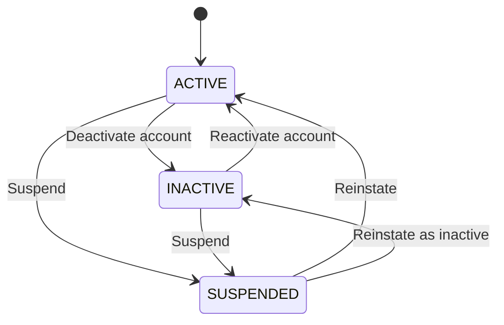

### 2. Store

#### Store

States: `DRAFT`, `PENDING_REVIEW`, `ACTIVE`, `INACTIVE`, `SUSPENDED`, `CLOSED`.

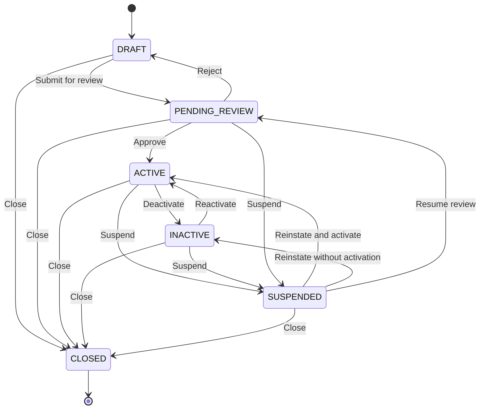

#### Store Membership

States: `ACTIVE`, `SUSPENDED`, `REMOVED`.

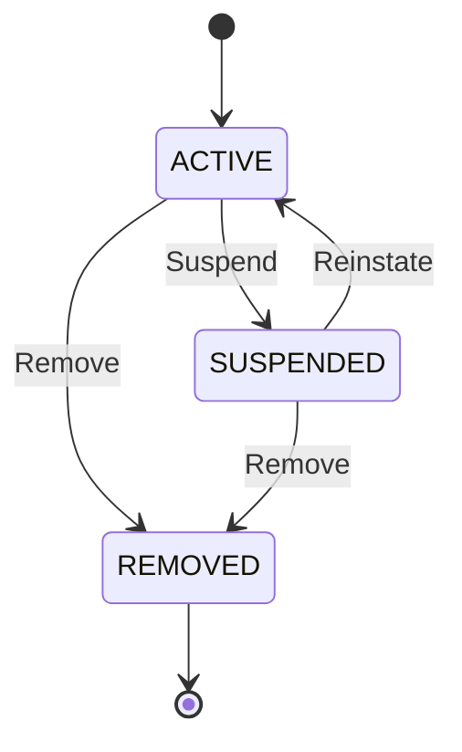

### 3. Tenant

#### Tenant

States: `ACTIVE`, `INACTIVE`, `SUSPENDED`, `CLOSED`.

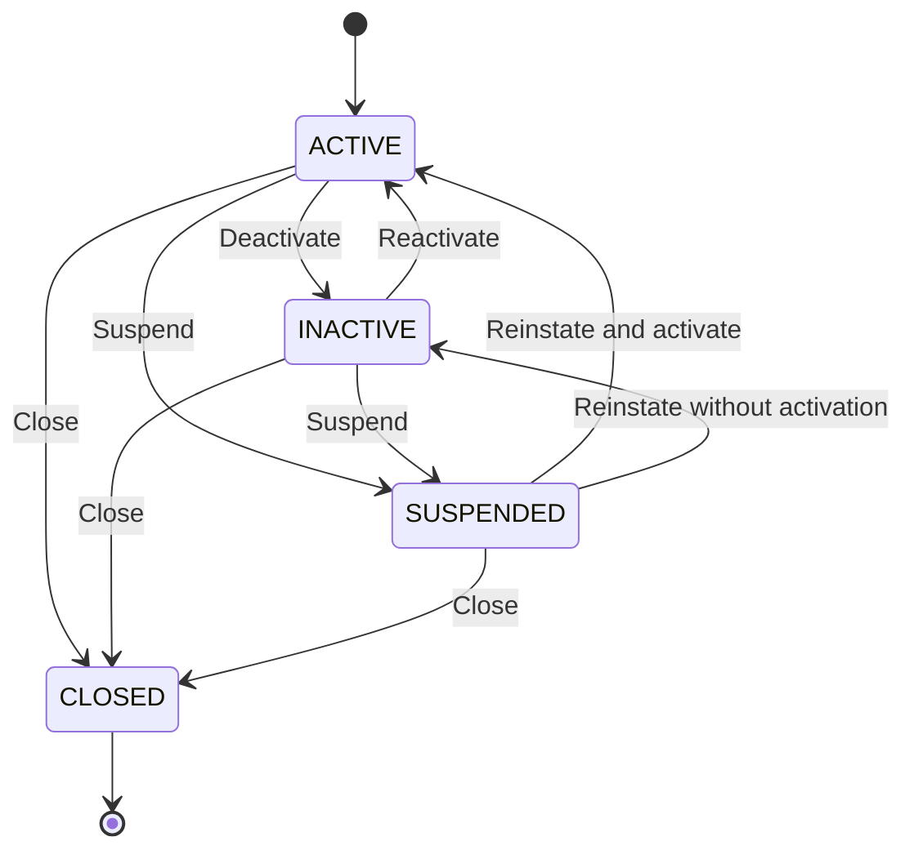

#### Tenant Membership

States: `ACTIVE`, `SUSPENDED`, `REMOVED`.

#### Tenant Invitation

States: `PENDING`, `ACCEPTED`, `REJECTED`, `CANCELLED`, `EXPIRED`.

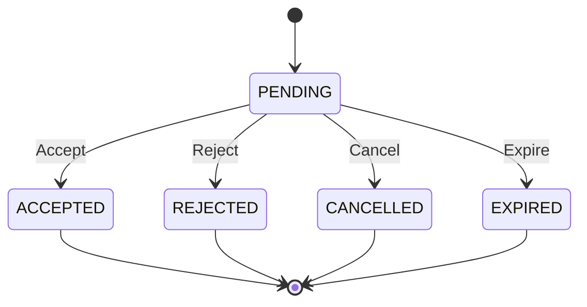

#### Tenant Verification

States: `PENDING`, `APPROVED`, `REJECTED`, `CANCELLED`, `EXPIRED`.

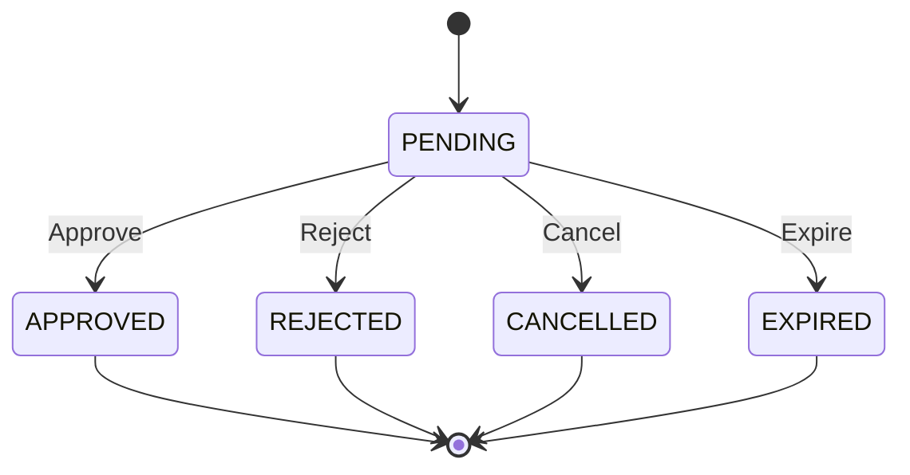

### 4. Role

#### Role

States: `ACTIVE`, `ARCHIVED`.

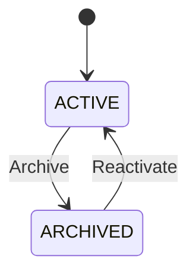

### 5. Product

#### Product

States: `ACTIVE`, `DISCONTINUED`, `ARCHIVED`.

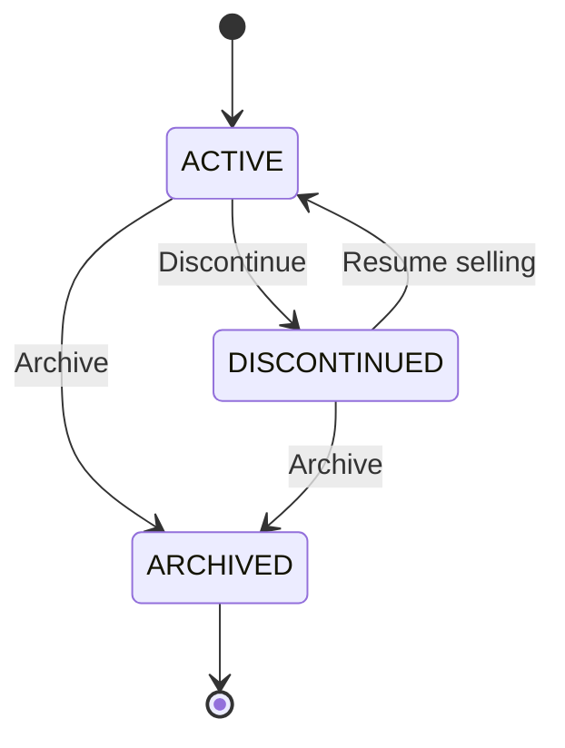

#### Product Category

States: `ACTIVE`, `ARCHIVED`.

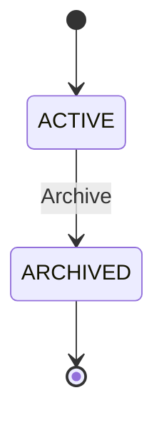

#### Product Version

States: `DRAFT`, `IN_REVIEW`, `REJECTED`, `PUBLISHED`, `SUPERSEDED`, `ARCHIVED`.

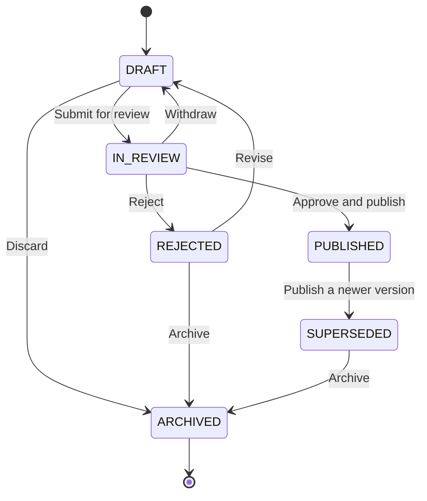

#### Product Variant Version

States: `DRAFT`, `IN_REVIEW`, `REJECTED`, `PUBLISHED`, `SUPERSEDED`, `ARCHIVED`.

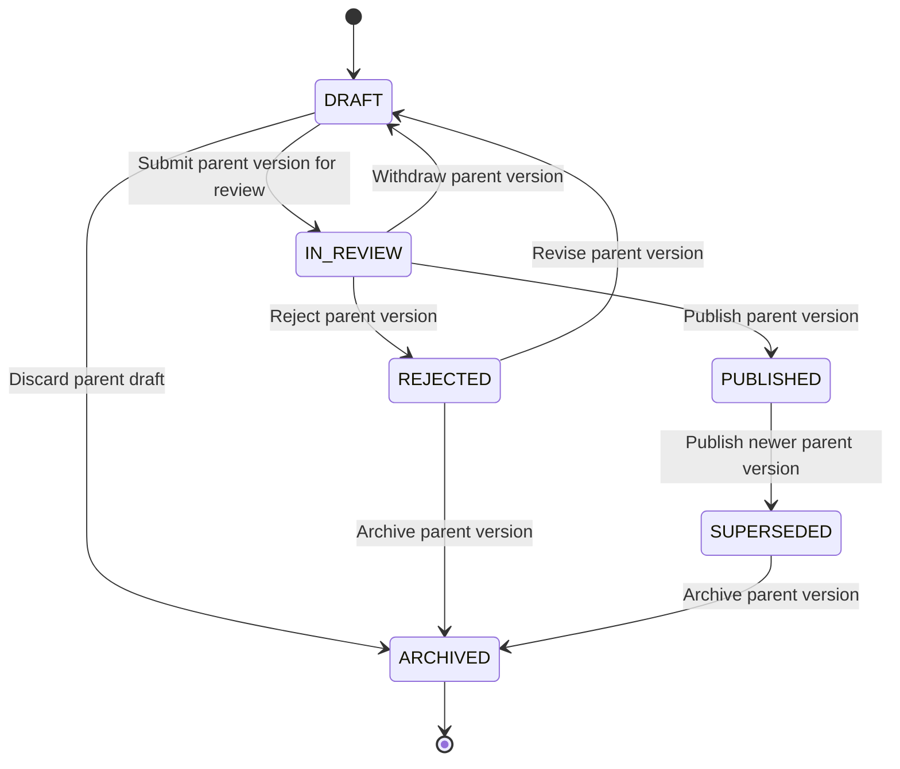

#### Product Variant

States: `ACTIVE`, `DISCONTINUED`, `ARCHIVED`.

#### Product Version Price

States: `SCHEDULED`, `ACTIVE`, `EXPIRED`, `CANCELLED`.

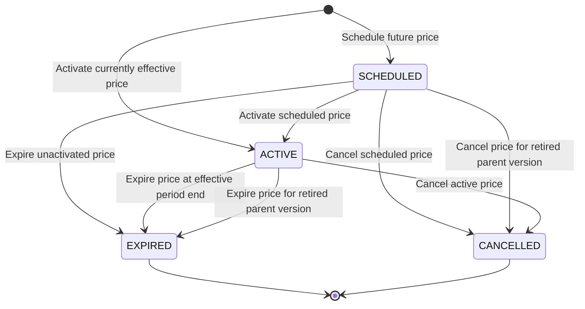

### 6. Inventory

#### Inventory Item

States: `ACTIVE`, `INACTIVE`, `ARCHIVED`.

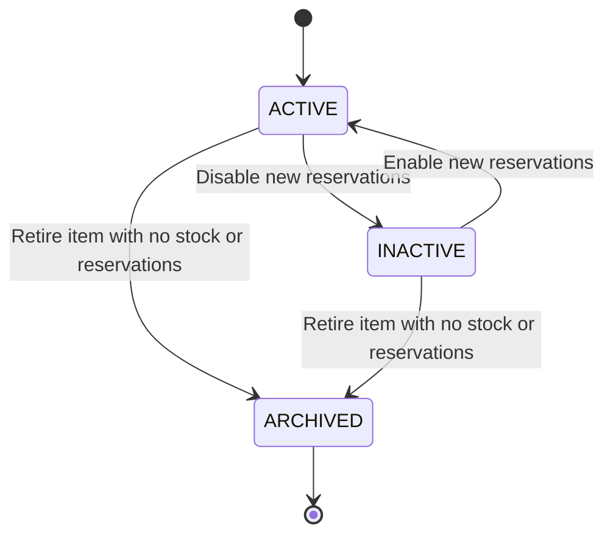

#### Inventory Reservation

States: `ACTIVE`, `CONSUMED`, `RELEASED`, `EXPIRED`.

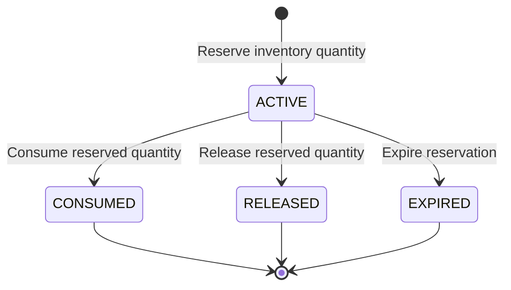